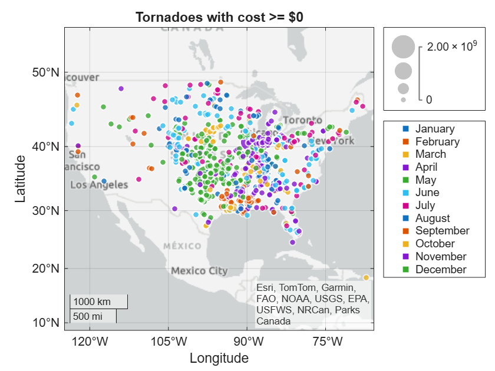

<a id="T_838ECBC6"></a>

# Explore and Analyze Tornadoes from 2013

Welcome to your first live script. This script gives you the opportunity to visualize a large dataset and explore its contents. Follow the instructions provided in each section and complete the interactions. As you progress through the course, you'll learn how to implement the various pieces yourself.


Throughout this course you'll be working with historical data from storm events in the United States. The files include over 40 different types of storm events, and contain information such as geographic location, date, damage cost in dollars, injuries, deaths, and text descriptions of the storm. 


There is a lot of missing data. For example, many events affect a large area, so no specific location is provided. As you explore the data, you'll see these represented as **`NaN`**, which stands for "not a number." Dealing with missing data is an important skill covered later, so don't worry about NaN entries for now.


This script explores the tornado events of 2013. There are many tornadoes in the data set. Nearly all tornado events have information for the location and damage associated with them. This makes tornadoes a great place to start. 

<!-- Begin Toc -->

## Table of Contents
&emsp;[Part 1: Import the Data](#H_AEF29358)
 
&emsp;&emsp;&emsp;[Data processing steps](#H_068DF7E2)
 
&emsp;[Part 2: Visualize the Locations of Tornadoes](#H_ED73F793)
 
&emsp;&emsp;[Plot all tornados above a damage threshold](#H_7746C5B7)
 
&emsp;&emsp;[Plot tornadoes for a given month](#H_99E00D65)
 
&emsp;[Part 3: Calculate Group Summary Statistics](#H_2FB427B5)
 
&emsp;&emsp;[Create a histogram of tornado events](#H_029963C7)
 
&emsp;&emsp;[Total damage by month](#H_59976D16)
 
&emsp;[Closing Remarks](#H_74316A4C)
 
<!-- End Toc -->
<a id="H_AEF29358"></a>

# Part 1: Import the Data
<a id="H_F338C6D8"></a>

This section imports the data using a function generated by the Import Tool. You'll learn how to do this Module 2.

1.  Click in this section to make it the active section.
2. In the **Live Editor** tab click **Run Section**.  
3. Explore the table to get a feel for the contents. Click on a variable to preview the contents. The table contains many columns, so scroll horizontally to see all the data.
4. Click on the `Begin_Date_Time` variable. Select "Sort Oldest to Newest" to order the events chronologically.
5. Click on the "Update Code" button and run the section again.
```matlab
events = importStormData("StormEvents_2013.csv")
```


| |Month|Event_Type|Begin_Date_Time|Timezone|Injuries_Direct|Injuries_Indirect|Deaths_Direct|Deaths_Indirect|Property_Cost|Crop_Cost|Begin_Lat|Begin_Lon|End_Lat|End_Lon|Episode_Narrative|Event_Narrative|
|:--:|:--:|:--:|:--:|:--:|:--:|:--:|:--:|:--:|:--:|:--:|:--:|:--:|:--:|:--:|:--:|:--:|
|1|February|Winter Weather|2013-02-23 19:00:00|EST-5|0|0|0|0|0|0|NaN|NaN|NaN|NaN|A coastal low moved southeast of southern New England.  As this occurred, an inverted trough set up, bringing snow to much of the area.  Snow amounts were low (under 3 inches) for much of the area.  However, the higher elevations ended up with 6+ inches of snow.|"Three to five inches of snow fell across eastern Hillsborough County."|
|2|December|Heavy Snow|2013-12-14 21:00:00|EST-5|0|0|0|0|0|0|NaN|NaN|NaN|NaN|Low pressure moved out of the midwest, off the mid-Atlantic coast and northeastward across Nantucket and the outer arm of Cape Cod bringing accumulating snow to much of southern New England.|"Eight to nine inches of snow fell across eastern Hillsborough County."|
|3|March|Heavy Snow|2013-03-07 15:00:00|EST-5|0|0|0|0|0|0|NaN|NaN|NaN|NaN|This storm brought heavy snow and significant coastal flooding to the forecast area. This was an unusual synoptic set-up, with low pressure lingering off the coast of southern New England for several days. Snowfall was difficult to forecast due to concerns about precipitation type and boundary layer temperature. In the end, precipitation type turned out to be all snow for much of the area, with most locations receiving 1 to 2 feet of snow.  In addition, the Massachusetts east coast was hit by widespread moderate and pockets of major coastal flooding for two high tide cycles and beach erosion for at least 5 high tide cycles.|"Five to sixteen inches of snow fell across eastern Hillsborough County."|
|4|October|Strong Wind|2013-10-07 18:30:00|EST-5|0|0|0|0|3000|0|NaN|NaN|NaN|NaN|A warm front moved northward across southern New England Sunday night (Oct 6) into Monday (Oct 7) creating a warm, moist, unstable atmosphere over the region.  Monday afternoon and evening (Oct 7) a strong cold front brought a line of strong to severe showers and storms through southern New England.  Strong, damaging winds occurred both with the storms and in the tight pressure gradient ahead of the front.|"A tree on Harbor Avenue was downed."|
|5|February|Heavy Snow|2013-02-08 15:00:00|EST-5|0|0|0|0|0|0|NaN|NaN|NaN|NaN|An historic winter storm deposited tremendous amounts of snow over all of southern New England, mainly from the mid-afternoon on Friday, February 8 and lasting into the daylight hours of Saturday, February 9. What made this an amazing storm was the widespread coverage of heavy snowfall.  Most locations received 2 to 2.5 feet of snow!  A stationary band of even heavier snowfall persisted from southwest NH through central MA and on to the southwest across central and western CT. In those areas, reports averaged closer to 2.5 to 3 feet! Isolated thunderstorms were common across the entire region during the height of the storm.\|\|A low pressure system advancing from the Great Lakes region combined forces with a very moist low pressure system moving northeast from the Gulf Coast states. Explosive deepening took place Friday evening, February 8, as a low center moved from the North Carolina coast to south of Nantucket.  Strong high pressure to the north of New England helped ensure that cold air remained in place over the area. Snowfall gained intensity during the afternoon, but during the night, 2 to 3 inch per hour amounts were common throughout the region. The band of heaviest snowfall, with 3 to 5 inches per hour for several hours, extended from southwest NH to central and western CT.  Snow ended in the morning in western and central MA, southwest NH, most of CT and RI, and in the early afternoon across eastern MA.|"Sixteen to twenty-four inches of snow fell across eastern Hillsborough County."|
|6|March|Heavy Snow|2013-03-18 22:00:00|EST-5|0|0|0|0|0|0|NaN|NaN|NaN|NaN|A coastal storm moved across the southern New England coastline, spreading a wintry mix of precipitation across much of the area.  While the precipitation started as snow for most locations, snow quickly transitioned to sleet and freezing rain across portions of Connecticut, Rhode Island, and southeastern Massachusetts.  Areas of northern Massachusetts and southwestern New Hampshire remained all snow and received around a foot of snow.|"Seven to fourteen inches of snow fell across eastern Hillsborough County."|
|7|November|High Wind|2013-11-24 14:45:00|EST-5|0|0|0|0|5000|0|NaN|NaN|NaN|NaN|Strong pressure rises behind a cold front coupled with cold air advection resulted in strong to damaging winds across much of southern New England. Most of the damage was to trees, some of which were still at least partially leaved.|"The Automated Surface Observing System at Manchester-Boston Regional Airport (KMHT) recorded a wind gust of 53 mph.  Higher gusts are estimated to have occurred elsewhere in eastern Hillsborough County.  In Nashua, a tree was downed at the intersection of East Dunstable Road and Shelley Drive."|
|8|December|Heavy Snow|2013-12-17 14:00:00|EST-5|0|0|0|0|0|0|NaN|NaN|NaN|NaN|Low pressure moved across Cape Cod bringing accumulating snow to much of southern New England.|"Five to seven inches of snow fell across eastern Hillsborough County."|
|9|January|High Wind|2013-01-31 08:00:00|EST-5|0|0|0|0|0|0|NaN|NaN|NaN|NaN|A warm front moved northward across southern New England.  This brought a period of mainly rain and warm temperatures.  In addition, a strong low level jet (up to 80 kts) resulted in high winds across much of southern New England.  There was some tree damage and downed power lines with winds gusting to 60 to 70 mph.|"An emergency manager reported sustained winds of 40 mph in Manchester.  No damage was reported."|
|10|January|Strong Wind|2013-01-20 15:00:00|EST-5|0|0|0|0|10000|0|NaN|NaN|NaN|NaN|A cold front moved across Southern New England, resulting in strong cold air advection and gusty winds.|"Trees and wires were downed on Longview and North Roads in Hancock.  Trees and wires were downed on Union Street and on Greenfield Road in Peterborough."|
|11|February|Blizzard|2013-02-08 21:00:00|EST-5|0|0|0|0|0|0|NaN|NaN|NaN|NaN|An historic winter storm deposited tremendous amounts of snow over all of southern New England, mainly from the mid-afternoon on Friday, February 8 and lasting into the daylight hours of Saturday, February 9. What made this an amazing storm was the widespread coverage of heavy snowfall.  Most locations received 2 to 2.5 feet of snow!  A stationary band of even heavier snowfall persisted from southwest NH through central MA and on to the southwest across central and western CT. In those areas, reports averaged closer to 2.5 to 3 feet! Isolated thunderstorms were common across the entire region during the height of the storm.\|\|A low pressure system advancing from the Great Lakes region combined forces with a very moist low pressure system moving northeast from the Gulf Coast states. Explosive deepening took place Friday evening, February 8, as a low center moved from the North Carolina coast to south of Nantucket.  Strong high pressure to the north of New England helped ensure that cold air remained in place over the area. Snowfall gained intensity during the afternoon, but during the night, 2 to 3 inch per hour amounts were common throughout the region. The band of heaviest snowfall, with 3 to 5 inches per hour for several hours, extended from southwest NH to central and western CT.  Snow ended in the morning in western and central MA, southwest NH, most of CT and RI, and in the early afternoon across eastern MA.|"Blizzard conditions were observed on the Automated Surface Observing System at Manchester-Boston Regional Airport (KMHT) for a total of three hours.  End time of this event was estimated due to the loss of wind sensors at almost all ASOS stations in Southern New England."|
|12|June|Hail|2013-06-14 12:46:00|CST-6|0|0|0|0|0|0|40.5300|-93.9100|40.5300|-93.9100|A warm front moved northeast across Missouri, during the afternoon hours of June, 14, 2013. A severe thunderstorm with one inch diameter hail was observed in Harrison County.|""|
|13|June|Flood|2013-06-15 14:50:00|CST-6|0|0|0|0|0|0|38.9958|-94.6726|38.9912|-94.6706|A very unstable airmass across extreme eastern Kansas, led to severe thunderstorm development, during the afternoon hours of June, 15, 2013. Damaging winds were observed with these storms.|"Heavy rains, caused street flooding with impassable conditions, at 75th Street and Metcalf Avenue."|
|14|June|Thunderstorm Wind|2013-06-15 14:50:00|CST-6|0|0|0|0|500|0|38.9100|-94.6300|38.9100|-94.6300|A very unstable airmass across extreme eastern Kansas, led to severe thunderstorm development, during the afternoon hours of June, 15, 2013. Damaging winds were observed with these storms.|"Trees and power lines were reported down, with thunderstorm wind gusts estimated up to 60 mph."|


<a id="H_068DF7E2"></a>

### Data processing steps
<a id="H_201C1707"></a>

As you explore new data, you'll typically discover there is some "clean\-up" to perform. You won't know this in advance. So, while it looks like the first thing you do is clean the data, that comes after some initial exploration. You'll learn more about the steps below in Modules 3 and 4. 

1.  Click **Run Section** to perform the preprocessing steps and move to the next section.
```matlab
% Put months in correct order
monthOrder = ["January", "February", "March", "April", "May", "June", "July",...
    "August", "September", "October", "November", "December"];
events.Month = reordercats(events.Month, monthOrder);
% Set missing Property and Crop Cost to $0
events.Property_Cost(ismissing(events.Property_Cost)) = 0;
events.Crop_Cost(ismissing(events.Crop_Cost)) = 0;
% Add total damage to the table
events.Total_Damage = events.Property_Cost + events.Crop_Cost;
```

**Description of code above**

-  By default, the text in the "Month" variable of the table is ordered alphabetically. The code reorders the categories to match the calendar. This is not necessary but makes the visualizations easier to interpret.  
-  Some events are missing information on the associated property and/or damage caused to property and crops. Missing cost is replaced with 0 as missing information likely means small or no damage to report. 
-  A new variable named  `Total_Damage` is added to the table. This variable is the sum of `Property_Cost + Crop_Cost`. 
<a id="H_ED73F793"></a>

# Part 2: Visualize the Locations of Tornadoes
<a id="H_7746C5B7"></a>

## Plot all tornados above a damage threshold

The code below creates a plot of tornado locations on a map. The size of the markers represents the cost in dollars of the damage caused by the tornado. The slider sets a minimum value for total damage of an event to be included in the plot.  

1.  Click into this section to make it the active section.
2. Click **Run Section** to visualize the results.
3. Click on the map to make the figure active.
4. Above the map Plus (+), Minus (-), and Home icons appear. Click the Plus icon to zoom in.
5. Zoom in further and/or pan on the map by clicking the mouse and dragging the map.
6. Click the Home icon to reset the view.
7. Set a threshold for damage caused by adjusting the slider.
<a id="H_2CF16EA4"></a>
```matlab
minDamage = 0;
```

There is no need to edit the code below. In Modules 3 and 4 you'll learn how to create visualizations and select subsets of data. Then in Module 5 you'll learn how to add an interactive control to interactively modify variable values.

```matlab
% Select tornadoes above a damage threshold set by the slider
tornadoes = events(events.Event_Type == "Tornado" & events.Total_Damage >= minDamage, :);
% Plot the results on a map
geobubble(tornadoes.Begin_Lat,tornadoes.Begin_Lon,tornadoes.Total_Damage, tornadoes.Month);
title("Tornadoes with cost >= $" + minDamage)
```



**Description of code above**

-  A new table with only tornadoes above the damage threshold is created.  
-  The location of tornadoes is plotted. 
<a id="H_99E00D65"></a>

## Plot tornadoes for a given month
<a id="H_73B1FBBD"></a>

Below is a drop\-down menu to explore the location of tornadoes for a given month. Observe how the number and location of tornadoes varies throughout the year. All tornadoes are treated as equal regardless of damage caused.

1.  Run this section.
2. A new figure is created. Use the Minus icon in the plot tools to zoom out until the region visible is similar to the figure in the previous section.
3. Click **Update Code**. This will set the axes limits so they don't change when you select a different month.
4. Select `May` from the drop\-down menu.
5. Explore other months.
```matlab
eventMonth = "March";
```

There is no need to edit the code below. The code recreates the tornadoes table so that all tornadoes are included. By the end of Module 3 you'll be able to select any Event\_Type and create a new table of just that category.

```matlab
tornadoes = events(events.Event_Type == "Tornado", :);
tornadoes = tornadoes(tornadoes.Month == eventMonth, :);
geobubble(tornadoes.Begin_Lat,tornadoes.Begin_Lon);
title("Tornadoes in the month of " + eventMonth)
```


<a id="H_2FB427B5"></a>

# Part 3: Calculate Group Summary Statistics
<a id="H_029963C7"></a>

## Create a histogram of tornado events
<a id="H_7DB1E095"></a>

In the section above, you may have noticed that some months have more tornadoes than others. This section creates a histogram to show the number of tornadoes by month.

-  Run this section. Which month has the most tornadoes? Is there a tornado season? 
```matlab
tornadoes = events(events.Event_Type == "Tornado",:)
```


| |Month|Event_Type|Begin_Date_Time|Timezone|Injuries_Direct|Injuries_Indirect|Deaths_Direct|Deaths_Indirect|Property_Cost|Crop_Cost|Begin_Lat|Begin_Lon|End_Lat|End_Lon|Episode_Narrative|Event_Narrative|Total_Damage|
|:--:|:--:|:--:|:--:|:--:|:--:|:--:|:--:|:--:|:--:|:--:|:--:|:--:|:--:|:--:|:--:|:--:|:--:|
|1|June|Tornado|2013-06-13 14:38:00|EST-5|0|0|0|0|1000|5000|39.0800|-77.3200|39.1080|-76.9470|A cold front stalled across the Mid Atlantic and low pressure formed and moved along it. Southerly flow advected gulf moisture into the region and showers and thunderstorms easily formed. Heavy rain, hail, damaging winds and tornadoes occurred throughout the day.|"From eyewitness accounts, radar imagery and a ground survey concluded a long track EF-0 tornado occurred in Montgomery County MD on the afternoon of June 13, 2013.  Peak winds were estimated at 75 mph.  Damage was almost entirely from downed trees.  In that regard numerous homes and a few parked vehicles were damaged by trees falling onto them.  \|\|First damage was noted near the Bretton Woods golf course along River Road.  Damage continued along Bonnie Dale Drive and Glenhurst Ct where several trees were downed in the community.  Also, near the intersection of Turkey Foot Road and Jones Lane in southwest Montgomery County near North Potomac MD a few large trees were over the road.  The tornado raced east at nearly 60 mph to the northern section of Rockville MD.  At least 14 homes were significantly damaged by uprooted trees.  As it continued east to the Norbeck and Aspen Hill area 30 trees were uprooted in the Manor County Golf Club as well as numerous homes damaged in the surrounding communiteis from tree damage.  Tree damage was noted along the intercounty connector route 200 at the Layhill Road exit.  Finally a few trees were downed in Spencerville and Burtonsville.\|\|Additionally there was a parallel 7 miles path of damage through South Rockville and Glenmont MD with similar tree damage.  This area was found to be straight line winds from the outflow just south of the tornado from the parent supercell storm."|6000|
|2|July|Tornado|2013-07-22 23:12:00|EST-5|0|0|0|0|3000|2000|39.6280|-76.1820|39.6320|-76.1690|A surface trough was over the area while an upper level disturbance moved overhead. Showers and thunderstorms produced heavy rainfall as they moved eastward towards the I-95 corridor.|"The tornado initially touched down in the 1300 block of Stafford Road where a pole barn was destroyed and a nearby house had exterior damage including removal of a window, siding and insulation.  The tornado then traveled on an east-northeast path along Stafford Road where numerous trees were topped and snapped and numerous crops were damaged along a convergent path in a cornfield.  The tornado lifted in the 1100 block of Stafford Road."|5000|
|3|October|Tornado|2013-10-04 17:25:00|CST-6|0|0|0|0|0|0|42.4918|-96.5900|42.5140|-96.5750|Thunderstorms produced three tornadoes which tracked over Dixon and Dakota Counties in extreme northeast Nebraska on the late afternoon of October 4th. One damaging tornado crossed into Dixon County from Wayne County Nebraska, a brief tornado formed and dissipated in Dixon County, and another tornado developed in northern Dakota County before crossing the Missouri River into Union County South Dakota.|"A tornado developed in northern Dakota County and caused no reported damage before crossing the Missouri River into Union County of South Dakota."|0|
|4|October|Tornado|2013-10-04 16:59:00|CST-6|0|0|0|0|0|0|42.3941|-96.7337|42.4023|-96.7263|Thunderstorms produced three tornadoes which tracked over Dixon and Dakota Counties in extreme northeast Nebraska on the late afternoon of October 4th. One damaging tornado crossed into Dixon County from Wayne County Nebraska, a brief tornado formed and dissipated in Dixon County, and another tornado developed in northern Dakota County before crossing the Missouri River into Union County South Dakota.|"A brief tornado, observed on video, cause no reported damage."|0|
|5|July|Tornado|2013-07-23 16:22:00|EST-5|0|0|0|0|20000|0|40.6940|-80.9430|40.6726|-80.9135|Numerous showers and thunderstorms developed ahead of and with a cold front moving across the upper Ohio Valley, with some severe storms across eastern Ohio, northern West Virginia, and western Pennsylvania. A brief tornado touched down near the border of Carroll and Columbiana counties, and a stronger downburst occurred in East Liverpool in Columbiana county.|"An NWS storm survey found a EF-0 tornado touched down in Carroll county and crossed into extreme western Columbiana county west of Summitville. See Storm Data for Columbiana county for the remainder of this tornado. The tornado touched down near the intersection of Apollo and Merline Roads, where a metal roof of a grain silo was removed and a small barn damaged. The path continued near Marigold Road where a trampoline was wrapped around a power pole. Damage to trees was then found along Nature and Lewis Roads, before the storm passed into Columbiana county near Acker Road. The total path of the tornado was 3.2 miles, with the maximum path width 75 yards. Estimated maximum wind speed was 75 MPH."|20000|
|6|June|Tornado|2013-06-04 18:16:00|CST-6|0|0|0|0|0|0|46.4300|-97.0300|46.4300|-97.0300|A surface boundary arched from a low northwest of Jamestown down to near Wahpeton, North Dakota. A tornado formed near the boundary west-southwest of Colfax.|"A short lived tornado was filmed west-southwest of Colfax."|0|
|7|June|Tornado|2013-06-25 22:25:00|CST-6|0|0|0|0|0|0|46.6500|-96.4200|46.6909|-96.3703|Thunderstorms formed over the Devils Lake region along a cold frontal boundary and low pressure system. Storms also initiated along the warm front which extended down into southeast North Dakota. Afternoon temperatures topped out in the low to mid 80s with dew points around 70. By mid evening of the 25th the storm tracked into the northwest quarter of Minnesota. Many reports of large hail, strong winds, and heavy rain were received.|"The tornado touched down about a mile west of the airport and tracked to the Interstate 94 exit north of town by 2230 CST. The tornado continued to about four miles northeast of town, a track length of about seven miles. The tornado was likely wrapped in heavy rain during portions of this track. One livestock loafing shed was lifted and collapsed and several trees were knocked down. Peak winds were estimated at 80 mph."|0|
|8|May|Tornado|2013-05-08 17:30:00|CST-6|0|0|0|0|0|0|38.9745|-99.1969|38.9746|-99.1931|A second day of severe weather moved across the area.  An upper level wind maximum entered the high plains as deep moisture and strong heating persisted.  Thunderstorms erupted during the late afternoon.|"An observer reported 2 tornadoes."|0|
|9|May|Tornado|2013-05-16 14:06:00|CST-6|0|0|0|0|0|0|32.3331|-93.7995|32.3303|-93.7705|An upper level low pressure system was moving slowly through Eastern Oklahoma into Western Arkansas during the afternoon hours of May 16th. A lone supercell thunderstorm across North Central Texas developed during the late morning hours of May 16th. This storm developed in a strongly sheared environment which allowed the storm to sustain itself. The storm moved south and east towards a strong instability axis which was oriented across Northeast Texas into Northwest Louisiana. With strong heating, strong instability developed and the supercell thunderstorm intensified as it moved south and east. The storm produced several tornado tracks, some of which occurred in Harrison County Texas and other into Southwest Caddo Parish and Northern Desoto Parish. The storm was a prolific hail and wind producer as well with wind gusts near 100 mph south of Shreveport, Louisiana with large fields of hail which turned numerous acres of land completely white.|"This tornado is a continuation of the tornado that first touched down in extreme southern Caddo Parish near Keithville Kingston Road.  The tornado then moved into extreme northern De Soto Parish where it continued to snap and or down trees.  The tornado lifted near Russel Road just west of Linwood Avenue.  The tornado was near a broad area of straight line winds caused by a downburst in northern De Soto Parish."|0|
|10|May|Tornado|2013-05-20 16:05:00|CST-6|0|0|0|0|0|0|37.5055|-101.8800|37.5017|-101.8797|High based thunderstorms developed rapidly across Stanton county and two landspouts were reported.|"There were two land spouts reported."|0|
|11|May|Tornado|2013-05-20 15:50:00|CST-6|0|0|0|0|0|0|37.4688|-101.9445|37.4640|-101.9415|High based thunderstorms developed rapidly across Stanton county and two landspouts were reported.|"There were two land spouts reported.  This one lasted the longest but there was no damage."|0|
|12|June|Tornado|2013-06-02 15:09:00|EST-5|0|0|0|0|150000|0|34.4900|-82.7900|34.5170|-82.7120|Despite effective bulk shear values of less than 25 knots, a mini-supercell thunderstorm developed in an airmass characterized by high surface dewpoints ahead of a tropical cyclone over the Gulf of Mexico. The storm produced an E1 tornado over western Anderson County. A few other reports of straight line wind damage and low end flooding also occurred with other storms on this day.|"An NWS storm survey found the path of a weak tornado that began in a field east of Lake Hartwell, just west of highway 187 north of the Country Meadows intersection. The tornado traveled east northeast to a farmstead on highway 187, blowing away a small outbuilding and peeling some metal panels off the roof of a larger shed. The tornado continued ENE to Busby Rd, where a portion of the roof was removed from a home. The house also shifted slightly on its foundation while a deck was lifted and tossed and a garage door caved in. The track has lost at this point, as the tornado moved over open fields. However, the path was picked up again at Mar-Mac Rd, near the Martin Rd intersection, where numerous trees were uprooted or snapped. Some shingles were removed from a home and some outbuildings damaged in this areas we well. The end of the damage path was found near Tiffany Dr and Oak Noll Terrace, where two large pine trees were blown onto a home, causing substantial damage."|150000|
|13|April|Tornado|2013-04-08 20:06:00|MST-7|0|0|0|0|250000|0|40.0656|-101.4581|40.0746|-101.4541|Thunderstorms developed by mid-afternoon in eastern Colorado and later moved into northwest Kansas and southwest Nebraska.  By evening, hail up to two inches in diameter was reported near Benkelman and Stratton.  A tornado damaged a farming operation northeast of Benkelman.  Later, strong winds gusting 60-65 mph occurred across Hitchcock and Red Willow counties.|"Report was first relayed to NWS from local newspaper, and later followed up with a storm survey.  Extensive damage to one farm and feed yard.  Several large outbuildings were destroyed, utility poles/fences were broken, a trailer was overturned and rolled.  Farm implements were moved.  At least two cows were put down due to injuries from the storm."|250000|
|14|July|Tornado|2013-07-26 14:25:00|CST-6|0|0|0|0|0|0|33.9430|-96.7310|33.9430|-96.7310|Storms developed across portions of southeastern Oklahoma on the afternoon of the 26th. Although the storms generally remained below severe limits, one storm briefly produced a tornado near Lake Texoma.|"KXII-TV received two public reports and a photograph of a tornado that was observed to briefly touch down from the Enos area of Marshall County near Lake Texoma. The time and the location of this tornado are estimated and no damage is known to have occurred."|0|


```matlab
histogram(tornadoes.Month)
title("Tornados by Month")
xlabel("Month")
ylabel("Number of Tornadoes")
```


<a id="H_59976D16"></a>

## Total damage by month

Looking at the histogram, the month of May had far more tornadoes than any other month. Now examine the damage caused by these tornadoes. 

1.  Run this section. A table showing the number of tornadoes for each month and the selected statistic is created. A bar plot shows the results.
2. Use the drop\-down menu to change the statistic calculated for each month.
```matlab
stat = "sum";
```

There is no need to edit the code below. In Module 4 you'll learn how to calculate statistics on groups in your data. Here, the code calculates the chosen statistic for each month on the `Total_Damage` variable in the table.

```matlab
tornadoes = events(events.Event_Type == "Tornado",:);
% Group tornadoes by month and calculate the selected stat
cost = groupsummary(tornadoes, "Month", stat, "Total_Damage")
```


| |Month|GroupCount|sum_Total_Damage|
|:--:|:--:|:--:|:--:|
|1|January|95|88605000|
|2|February|44|40211000|
|3|March|25|1370000|
|4|April|94|15927500|
|5|May|301|2.3525e+09|
|6|June|131|5648500|
|7|July|77|10251250|
|8|August|55|20513000|
|9|September|21|408000|
|10|October|71|10437000|
|11|November|117|1.0944e+09|
|12|December|22|8468000|


```matlab
% View the results using a bar chart
bar(cost.Month, cost{:, end})
title(stat + " of tornado cost by month")
ylabel("Cost in dollars")
```


<a id="H_6873A476"></a>

**Description of code above**


The `groupsummary` function returns a table. The table includes the number of events in each group and the statistic for the selected variable. In this example, the data is grouped by the `Month` variable. The statistic selected in the drop\-down menu is applied to the `Total_Damage` variable. The result is added to the last column of the table. A bar plot is used to visualize the result.

<a id="H_74316A4C"></a>

# Closing Remarks

Notice how quickly creating a variety of visualizations provided an overview of lots of data. What have you learned about tornadoes in the United States in 2013? Hopefully you gained a feel for the data. This is important later when trying to evaluate predictive models. Without a feel for the data, it's difficult to look at the output of a complex model and determine if the results are reasonable.

<a id="H_E0B13F0C"></a>

For now, you can state that in 2013:

-  The frequency of tornadoes was less during the winter months than late spring/early summer 
-  Winter tornadoes tend to be in the southern United States 
-  An extremely damaging tornado occurred in November 

Maybe you have a lot more questions. For example, what states are most affected? What do the results look like for different years? This script just looks at tornadoes, what about all the other storm events? The fun, and challenging, aspect of having lots of data is trying to explore all the possible questions and relationships. By the end of this course you'll have the skills to answer these questions and more.


 **Hint.** You can look at other years by changing the year in the filename in the first line of code!

<a id="H_E6630148"></a>
