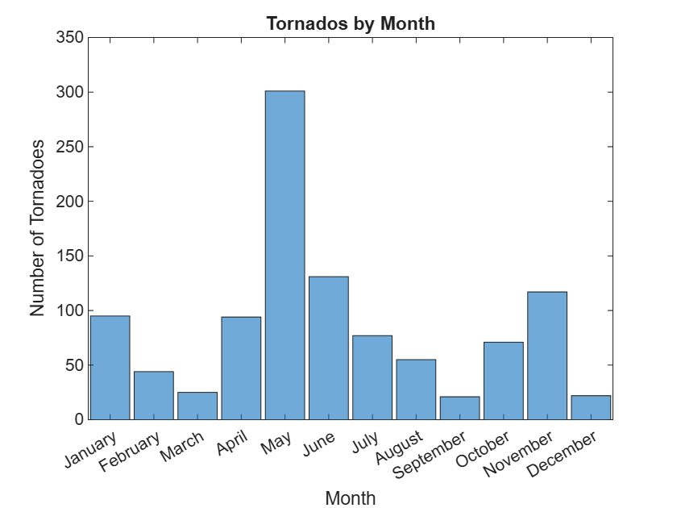

<a id="T_838ECBC6"></a>

# Explore and Analyze Tornadoes from 2013

Welcome to your first live script. This script gives you the opportunity to visualize a large dataset and explore its contents. Follow the instructions provided in each section and complete the interactions. As you progress through the course, you'll learn how to implement the various pieces yourself.


Throughout this course you'll be working with historical data from storm events in the United States. The files include over 40 different types of storm events, and contain information such as geographic location, date, damage cost in dollars, injuries, deaths, and text descriptions of the storm. 


There is a lot of missing data. For example, many events affect a large area, so no specific location is provided. As you explore the data, you'll see these represented as **`NaN`**, which stands for "not a number." Dealing with missing data is an important skill covered later, so don't worry about NaN entries for now.


This script explores the tornado events of 2013. There are many tornadoes in the data set. Nearly all tornado events have information for the location and damage associated with them. This makes tornadoes a great place to start. 

<!-- Begin Toc -->

## Table of Contents
&emsp;[Part 1: Import the Data](#H_AEF29358)
 
&emsp;&emsp;&emsp;[Data processing steps](#H_068DF7E2)
 
&emsp;[Part 2: Visualize the Locations of Tornadoes](#H_ED73F793)
 
&emsp;&emsp;[Plot all tornados above a damage threshold](#H_7746C5B7)
 
&emsp;&emsp;[Plot tornadoes for a given month](#H_99E00D65)
 
&emsp;[Part 3: Calculate Group Summary Statistics](#H_2FB427B5)
 
&emsp;&emsp;[Create a histogram of tornado events](#H_029963C7)
 
&emsp;&emsp;[Total damage by month](#H_59976D16)
 
&emsp;[Closing Remarks](#H_74316A4C)
 
<!-- End Toc -->
<a id="H_AEF29358"></a>

# Part 1: Import the Data
<a id="H_F338C6D8"></a>

This section imports the data using a function generated by the Import Tool. You'll learn how to do this Module 2.

1.  Click in this section to make it the active section.
2. In the **Live Editor** tab click **Run Section**.  
3. Explore the table to get a feel for the contents. Click on a variable to preview the contents. The table contains many columns, so scroll horizontally to see all the data.
4. Click on the `Begin_Date_Time` variable. Select "Sort Oldest to Newest" to order the events chronologically.
5. Click on the "Update Code" button and run the section again.
```matlab
events = importStormData("StormEvents_2013.csv")
events = sortrows(events, "Begin_Date_Time")
```


| |Month|Event_Type|Begin_Date_Time|Timezone|Injuries_Direct|Injuries_Indirect|Deaths_Direct|Deaths_Indirect|Property_Cost|Crop_Cost|Begin_Lat|Begin_Lon|End_Lat|End_Lon|Episode_Narrative|Event_Narrative|
|:--:|:--:|:--:|:--:|:--:|:--:|:--:|:--:|:--:|:--:|:--:|:--:|:--:|:--:|:--:|:--:|:--:|
|1|January|Drought|2013-01-01 00:00:00|CST-6|0|0|0|0|0|0|NaN|NaN|NaN|NaN|The drought that began in June and expanded to become an Exceptional (D4) Drought in 2012 continues into January 2013. While the weather in January was characterized as progressive the storm track provided little relief or recharge to the depleted soil moisture. Short term impacts are expected to hit agriculture and grasslands, while the long-term impacts to hydrological and ecological interests are expected to linger. In January some rainfall did occur although departures remain over four inches that keep fire dangers and potential impacts at the forefront and in the news.|"The drought that began in June 2012 continued into January 2013. The exceptional (D4) drought lingered as below normal precipitation fell during the month."|
|2|January|Drought|2013-01-01 00:00:00|CST-6|0|0|0|0|0|0|NaN|NaN|NaN|NaN|The drought that began in June and expanded to become an Exceptional (D4) Drought in 2012 continues into January 2013. While the weather in January was characterized as progressive the storm track provided little relief or recharge to the depleted soil moisture. Short term impacts are expected to hit agriculture and grasslands, while the long-term impacts to hydrological and ecological interests are expected to linger. In January some rainfall did occur although departures remain over four inches that keep fire dangers and potential impacts at the forefront and in the news.|"The drought that began in June 2012 continued into January 2013. The exceptional (D4) drought lingered as below normal precipitation fell during the month."|
|3|January|Drought|2013-01-01 00:00:00|MST-7|0|0|0|0|0|0|NaN|NaN|NaN|NaN|The drought that began in June and expanded to become an Exceptional (D4) Drought in 2012 continues into January 2013. While the weather in January was characterized as progressive the storm track provided little relief or recharge to the depleted soil moisture. Short term impacts are expected to hit agriculture and grasslands, while the long-term impacts to hydrological and ecological interests are expected to linger. In January some rainfall did occur although departures remain over four inches that keep fire dangers and potential impacts at the forefront and in the news.|"The drought that began in June 2012 continued into January 2013. The exceptional (D4) drought lingered as below normal precipitation fell during the month."|
|4|January|Drought|2013-01-01 00:00:00|CST-6|0|0|0|0|0|0|NaN|NaN|NaN|NaN|The drought that began in June and expanded to become an Exceptional (D4) Drought in 2012 continues into January 2013. While the weather in January was characterized as progressive the storm track provided little relief or recharge to the depleted soil moisture. Short term impacts are expected to hit agriculture and grasslands, while the long-term impacts to hydrological and ecological interests are expected to linger. In January some rainfall did occur although departures remain over four inches that keep fire dangers and potential impacts at the forefront and in the news.|"The drought that began in June 2012 continued into January 2013. The exceptional (D4) drought lingered as below normal precipitation fell during the month."|
|5|January|Drought|2013-01-01 00:00:00|MST-7|0|0|0|0|0|0|NaN|NaN|NaN|NaN|The drought that began in June and expanded to become an Exceptional (D4) Drought in 2012 continues into January 2013. While the weather in January was characterized as progressive the storm track provided little relief or recharge to the depleted soil moisture. Short term impacts are expected to hit agriculture and grasslands, while the long-term impacts to hydrological and ecological interests are expected to linger. In January some rainfall did occur although departures remain over four inches that keep fire dangers and potential impacts at the forefront and in the news.|"The drought that began in June 2012 continued into January 2013. The exceptional (D4) drought lingered as below normal precipitation fell during the month."|
|6|January|Drought|2013-01-01 00:00:00|CST-6|0|0|0|0|0|0|NaN|NaN|NaN|NaN|The drought that began in June and expanded to become an Exceptional (D4) Drought in 2012 continues into January 2013. While the weather in January was characterized as progressive the storm track provided little relief or recharge to the depleted soil moisture. Short term impacts are expected to hit agriculture and grasslands, while the long-term impacts to hydrological and ecological interests are expected to linger. In January some rainfall did occur although departures remain over four inches that keep fire dangers and potential impacts at the forefront and in the news.|"The drought that began in June 2012 continued into January 2013. The exceptional (D4) drought lingered as below normal precipitation fell during the month."|
|7|January|Drought|2013-01-01 00:00:00|CST-6|0|0|0|0|0|0|NaN|NaN|NaN|NaN|The drought that began in June and expanded to become an Exceptional (D4) Drought in 2012 continues into January 2013. While the weather in January was characterized as progressive the storm track provided little relief or recharge to the depleted soil moisture. Short term impacts are expected to hit agriculture and grasslands, while the long-term impacts to hydrological and ecological interests are expected to linger. In January some rainfall did occur although departures remain over four inches that keep fire dangers and potential impacts at the forefront and in the news.|"The drought that began in June 2012 continued into January 2013. The exceptional (D4) drought lingered as below normal precipitation fell during the month."|
|8|January|Drought|2013-01-01 00:00:00|MST-7|0|0|0|0|0|0|NaN|NaN|NaN|NaN|The drought that began in June and expanded to become an Exceptional (D4) Drought in 2012 continues into January 2013. While the weather in January was characterized as progressive the storm track provided little relief or recharge to the depleted soil moisture. Short term impacts are expected to hit agriculture and grasslands, while the long-term impacts to hydrological and ecological interests are expected to linger. In January some rainfall did occur although departures remain over four inches that keep fire dangers and potential impacts at the forefront and in the news.|"The drought that began in June 2012 continued into January 2013. The exceptional (D4) drought lingered as below normal precipitation fell during the month."|
|9|January|Drought|2013-01-01 00:00:00|CST-6|0|0|0|0|0|0|NaN|NaN|NaN|NaN|The drought that began in June and expanded to become an Exceptional (D4) Drought in 2012 continues into January 2013. While the weather in January was characterized as progressive the storm track provided little relief or recharge to the depleted soil moisture. Short term impacts are expected to hit agriculture and grasslands, while the long-term impacts to hydrological and ecological interests are expected to linger. In January some rainfall did occur although departures remain over four inches that keep fire dangers and potential impacts at the forefront and in the news.|"The drought that began in June 2012 continued into January 2013. The exceptional (D4) drought lingered as below normal precipitation fell during the month."|
|10|January|Drought|2013-01-01 00:00:00|MST-7|0|0|0|0|0|0|NaN|NaN|NaN|NaN|The drought that began in June and expanded to become an Exceptional (D4) Drought in 2012 continues into January 2013. While the weather in January was characterized as progressive the storm track provided little relief or recharge to the depleted soil moisture. Short term impacts are expected to hit agriculture and grasslands, while the long-term impacts to hydrological and ecological interests are expected to linger. In January some rainfall did occur although departures remain over four inches that keep fire dangers and potential impacts at the forefront and in the news.|"The drought that began in June 2012 continued into January 2013. The exceptional (D4) drought lingered as below normal precipitation fell during the month."|
|11|January|Drought|2013-01-01 00:00:00|CST-6|0|0|0|0|0|0|NaN|NaN|NaN|NaN|The drought that began in June and expanded to become an Exceptional (D4) Drought in 2012 continues into January 2013. While the weather in January was characterized as progressive the storm track provided little relief or recharge to the depleted soil moisture. Short term impacts are expected to hit agriculture and grasslands, while the long-term impacts to hydrological and ecological interests are expected to linger. In January some rainfall did occur although departures remain over four inches that keep fire dangers and potential impacts at the forefront and in the news.|"The drought that began in June 2012 continued into January 2013. The exceptional (D4) drought lingered as below normal precipitation fell during the month."|
|12|January|Drought|2013-01-01 00:00:00|CST-6|0|0|0|0|0|0|NaN|NaN|NaN|NaN|The drought that began in June and expanded to become an Exceptional (D4) Drought in 2012 continues into January 2013. While the weather in January was characterized as progressive the storm track provided little relief or recharge to the depleted soil moisture. Short term impacts are expected to hit agriculture and grasslands, while the long-term impacts to hydrological and ecological interests are expected to linger. In January some rainfall did occur although departures remain over four inches that keep fire dangers and potential impacts at the forefront and in the news.|"The drought that began in June 2012 continued into January 2013. The exceptional (D4) drought lingered as below normal precipitation fell during the month."|
|13|January|Drought|2013-01-01 00:00:00|MST-7|0|0|0|0|0|0|NaN|NaN|NaN|NaN|The drought that began in June and expanded to become an Exceptional (D4) Drought in 2012 continues into January 2013. While the weather in January was characterized as progressive the storm track provided little relief or recharge to the depleted soil moisture. Short term impacts are expected to hit agriculture and grasslands, while the long-term impacts to hydrological and ecological interests are expected to linger. In January some rainfall did occur although departures remain over four inches that keep fire dangers and potential impacts at the forefront and in the news.|"The drought that began in June 2012 continued into January 2013. The exceptional (D4) drought lingered as below normal precipitation fell during the month."|
|14|January|Drought|2013-01-01 00:00:00|CST-6|0|0|0|0|NaN|NaN|NaN|NaN|NaN|NaN|Snowfall amounts averaged 3 to 10 inches across western Wisconsin in the counties still affected by the drought. This was not enough precipitation for any change in the drought conditions and a severe drought remained across Buffalo, Grant, Taylor, and Trempealeau Counties.|"Snowfall amounts across Buffalo County averaged 3 to 4 inches during January from about a half to three quarters of an inch of liquid precipitation. This was not enough to create any change in the drought conditions with the entire county remaining in a severe drought."|
|15|January|Drought|2013-01-01 00:00:00|CST-6|0|0|0|0|NaN|NaN|NaN|NaN|NaN|NaN|Snowfall amounts averaged 3 to 10 inches across western Wisconsin in the counties still affected by the drought. This was not enough precipitation for any change in the drought conditions and a severe drought remained across Buffalo, Grant, Taylor, and Trempealeau Counties.|"Snowfall amounts across southern Grant County averaged 5 to 8 inches during January from about 1.5 to 2 inches of liquid precipitation. This was not enough to create any change in the drought conditions with the far southern portions of the county remaining in a severe drought."|
|16|January|Drought|2013-01-01 00:00:00|CST-6|0|0|0|0|NaN|NaN|NaN|NaN|NaN|NaN|Snowfall amounts averaged 3 to 10 inches across western Wisconsin in the counties still affected by the drought. This was not enough precipitation for any change in the drought conditions and a severe drought remained across Buffalo, Grant, Taylor, and Trempealeau Counties.|"Snowfall amounts across Taylor County averaged 7 to 10 inches during January from about three quarters of an inch of liquid precipitation. This was not enough to create any change in the drought conditions with the northern half of the county remaining in a severe drought."|
|17|January|Drought|2013-01-01 00:00:00|CST-6|0|0|0|0|NaN|NaN|NaN|NaN|NaN|NaN|Snowfall amounts averaged 3 to 10 inches across western Wisconsin in the counties still affected by the drought. This was not enough precipitation for any change in the drought conditions and a severe drought remained across Buffalo, Grant, Taylor, and Trempealeau Counties.|"Snowfall amounts across Trempealeau County averaged 4 to 6 inches during January from about three quarters of an inch of liquid precipitation. This was not enough to create any change in the drought conditions with the northern half of the county remaining in a severe drought."|
|18|January|Drought|2013-01-01 00:00:00|CST-6|0|0|0|0|0|0|NaN|NaN|NaN|NaN|The drought that began in June and expanded to become an Exceptional (D4) Drought in 2012 continues into January 2013. While the weather in January was characterized as progressive the storm track provided little relief or recharge to the depleted soil moisture. Short term impacts are expected to hit agriculture and grasslands, while the long-term impacts to hydrological and ecological interests are expected to linger. In January some rainfall did occur although departures remain over four inches that keep fire dangers and potential impacts at the forefront and in the news.|"The drought that began in June 2012 continued into January 2013. The exceptional (D4) drought lingered as below normal precipitation fell during the month."|
|19|January|Drought|2013-01-01 00:00:00|CST-6|0|0|0|0|0|0|NaN|NaN|NaN|NaN|The drought that began in June and expanded to become an Exceptional (D4) Drought in 2012 continues into January 2013. While the weather in January was characterized as progressive the storm track provided little relief or recharge to the depleted soil moisture. Short term impacts are expected to hit agriculture and grasslands, while the long-term impacts to hydrological and ecological interests are expected to linger. In January some rainfall did occur although departures remain over four inches that keep fire dangers and potential impacts at the forefront and in the news.|"The drought that began in June 2012 continued into January 2013. The exceptional (D4) drought lingered as below normal precipitation fell during the month."|
|20|January|Drought|2013-01-01 00:00:00|MST-7|0|0|0|0|0|0|NaN|NaN|NaN|NaN|The drought that began in June and expanded to become an Exceptional (D4) Drought in 2012 continues into January 2013. While the weather in January was characterized as progressive the storm track provided little relief or recharge to the depleted soil moisture. Short term impacts are expected to hit agriculture and grasslands, while the long-term impacts to hydrological and ecological interests are expected to linger. In January some rainfall did occur although departures remain over four inches that keep fire dangers and potential impacts at the forefront and in the news.|"The drought that began in June 2012 continued into January 2013. The exceptional (D4) drought lingered as below normal precipitation fell during the month."|
|21|January|Drought|2013-01-01 00:00:00|CST-6|0|0|0|0|0|0|NaN|NaN|NaN|NaN|The drought that began in June and expanded to become an Exceptional (D4) Drought in 2012 continues into January 2013. While the weather in January was characterized as progressive the storm track provided little relief or recharge to the depleted soil moisture. Short term impacts are expected to hit agriculture and grasslands, while the long-term impacts to hydrological and ecological interests are expected to linger. In January some rainfall did occur although departures remain over four inches that keep fire dangers and potential impacts at the forefront and in the news.|"The drought that began in June 2012 continued into January 2013. The exceptional (D4) drought lingered as below normal precipitation fell during the month."|
|22|January|High Surf|2013-01-01 00:00:00|HST-10|0|0|0|0|0|0|NaN|NaN|NaN|NaN|A series of swells from a deep low far northwest of the islands caused surf of 15 to 25 feet along the north- and west-facing shores of Niihau and Kauai, and the north-facing shores of Oahu, Molokai, and Maui; and 10 to 18 feet along the west-facing shores of Oahu and Molokai. Lifeguards rescued several people in trouble and warned many others to stay away from the rough surf if they were not experienced in such conditions. No serious injuries or property damage were reported.  This is the continuation of an episode that began at the end of December 2012.|""|
|23|January|High Surf|2013-01-01 00:00:00|HST-10|0|0|0|0|0|0|NaN|NaN|NaN|NaN|A series of swells from a deep low far northwest of the islands caused surf of 15 to 25 feet along the north- and west-facing shores of Niihau and Kauai, and the north-facing shores of Oahu, Molokai, and Maui; and 10 to 18 feet along the west-facing shores of Oahu and Molokai. Lifeguards rescued several people in trouble and warned many others to stay away from the rough surf if they were not experienced in such conditions. No serious injuries or property damage were reported.  This is the continuation of an episode that began at the end of December 2012.|""|
|24|January|High Surf|2013-01-01 00:00:00|HST-10|0|0|0|0|0|0|NaN|NaN|NaN|NaN|A series of swells from a deep low far northwest of the islands caused surf of 15 to 25 feet along the north- and west-facing shores of Niihau and Kauai, and the north-facing shores of Oahu, Molokai, and Maui; and 10 to 18 feet along the west-facing shores of Oahu and Molokai. Lifeguards rescued several people in trouble and warned many others to stay away from the rough surf if they were not experienced in such conditions. No serious injuries or property damage were reported.  This is the continuation of an episode that began at the end of December 2012.|""|
|25|January|High Surf|2013-01-01 00:00:00|HST-10|0|0|0|0|0|0|NaN|NaN|NaN|NaN|A series of swells from a deep low far northwest of the islands caused surf of 15 to 25 feet along the north- and west-facing shores of Niihau and Kauai, and the north-facing shores of Oahu, Molokai, and Maui; and 10 to 18 feet along the west-facing shores of Oahu and Molokai. Lifeguards rescued several people in trouble and warned many others to stay away from the rough surf if they were not experienced in such conditions. No serious injuries or property damage were reported.  This is the continuation of an episode that began at the end of December 2012.|""|
|26|January|High Surf|2013-01-01 00:00:00|HST-10|0|0|0|0|0|0|NaN|NaN|NaN|NaN|A series of swells from a deep low far northwest of the islands caused surf of 15 to 25 feet along the north- and west-facing shores of Niihau and Kauai, and the north-facing shores of Oahu, Molokai, and Maui; and 10 to 18 feet along the west-facing shores of Oahu and Molokai. Lifeguards rescued several people in trouble and warned many others to stay away from the rough surf if they were not experienced in such conditions. No serious injuries or property damage were reported.  This is the continuation of an episode that began at the end of December 2012.|""|
|27|January|High Surf|2013-01-01 00:00:00|HST-10|0|0|0|0|0|0|NaN|NaN|NaN|NaN|A series of swells from a deep low far northwest of the islands caused surf of 15 to 25 feet along the north- and west-facing shores of Niihau and Kauai, and the north-facing shores of Oahu, Molokai, and Maui; and 10 to 18 feet along the west-facing shores of Oahu and Molokai. Lifeguards rescued several people in trouble and warned many others to stay away from the rough surf if they were not experienced in such conditions. No serious injuries or property damage were reported.  This is the continuation of an episode that began at the end of December 2012.|""|
|28|January|High Surf|2013-01-01 00:00:00|HST-10|0|0|0|0|0|0|NaN|NaN|NaN|NaN|A series of swells from a deep low far northwest of the islands caused surf of 15 to 25 feet along the north- and west-facing shores of Niihau and Kauai, and the north-facing shores of Oahu, Molokai, and Maui; and 10 to 18 feet along the west-facing shores of Oahu and Molokai. Lifeguards rescued several people in trouble and warned many others to stay away from the rough surf if they were not experienced in such conditions. No serious injuries or property damage were reported.  This is the continuation of an episode that began at the end of December 2012.|""|
|29|January|High Surf|2013-01-01 00:00:00|HST-10|0|0|0|0|0|0|NaN|NaN|NaN|NaN|A series of swells from a deep low far northwest of the islands caused surf of 15 to 25 feet along the north- and west-facing shores of Niihau and Kauai, and the north-facing shores of Oahu, Molokai, and Maui; and 10 to 18 feet along the west-facing shores of Oahu and Molokai. Lifeguards rescued several people in trouble and warned many others to stay away from the rough surf if they were not experienced in such conditions. No serious injuries or property damage were reported.  This is the continuation of an episode that began at the end of December 2012.|""|
|30|January|Drought|2013-01-01 00:00:00|CST-6|0|0|0|0|0|0|NaN|NaN|NaN|NaN|The drought that began in June and expanded to become an Exceptional (D4) Drought in 2012 continues into January 2013. While the weather in January was characterized as progressive the storm track provided little relief or recharge to the depleted soil moisture. Short term impacts are expected to hit agriculture and grasslands, while the long-term impacts to hydrological and ecological interests are expected to linger. In January some rainfall did occur although departures remain over four inches that keep fire dangers and potential impacts at the forefront and in the news.|"The drought that began in June 2012 continued into January 2013. The exceptional (D4) drought lingered as below normal precipitation fell during the month."|
|31|January|High Surf|2013-01-01 00:00:00|HST-10|0|0|0|0|0|0|NaN|NaN|NaN|NaN|A series of swells from a deep low far northwest of the islands caused surf of 15 to 25 feet along the north- and west-facing shores of Niihau and Kauai, and the north-facing shores of Oahu, Molokai, and Maui; and 10 to 18 feet along the west-facing shores of Oahu and Molokai. Lifeguards rescued several people in trouble and warned many others to stay away from the rough surf if they were not experienced in such conditions. No serious injuries or property damage were reported.  This is the continuation of an episode that began at the end of December 2012.|""|
|32|January|High Surf|2013-01-01 00:00:00|HST-10|0|0|0|0|0|0|NaN|NaN|NaN|NaN|A series of swells from a deep low far northwest of the islands caused surf of 15 to 25 feet along the north- and west-facing shores of Niihau and Kauai, and the north-facing shores of Oahu, Molokai, and Maui; and 10 to 18 feet along the west-facing shores of Oahu and Molokai. Lifeguards rescued several people in trouble and warned many others to stay away from the rough surf if they were not experienced in such conditions. No serious injuries or property damage were reported.  This is the continuation of an episode that began at the end of December 2012.|""|
|33|January|High Surf|2013-01-01 00:00:00|HST-10|0|0|0|0|0|0|NaN|NaN|NaN|NaN|A series of swells from a deep low far northwest of the islands caused surf of 15 to 25 feet along the north- and west-facing shores of Niihau and Kauai, and the north-facing shores of Oahu, Molokai, and Maui; and 10 to 18 feet along the west-facing shores of Oahu and Molokai. Lifeguards rescued several people in trouble and warned many others to stay away from the rough surf if they were not experienced in such conditions. No serious injuries or property damage were reported.  This is the continuation of an episode that began at the end of December 2012.|""|
|34|January|Drought|2013-01-01 00:00:00|MST-7|0|0|0|0|0|0|NaN|NaN|NaN|NaN|The drought that began in June and expanded to become an Exceptional (D4) Drought in 2012 continues into January 2013. While the weather in January was characterized as progressive the storm track provided little relief or recharge to the depleted soil moisture. Short term impacts are expected to hit agriculture and grasslands, while the long-term impacts to hydrological and ecological interests are expected to linger. In January some rainfall did occur although departures remain over four inches that keep fire dangers and potential impacts at the forefront and in the news.|"The drought that began in June 2012 continued into January 2013. The exceptional (D4) drought lingered as below normal precipitation fell during the month."|
|35|January|Drought|2013-01-01 00:00:00|MST-7|0|0|0|0|0|0|NaN|NaN|NaN|NaN|The drought that began in June and expanded to become an Exceptional (D4) Drought in 2012 continues into January 2013. While the weather in January was characterized as progressive the storm track provided little relief or recharge to the depleted soil moisture. Short term impacts are expected to hit agriculture and grasslands, while the long-term impacts to hydrological and ecological interests are expected to linger. In January some rainfall did occur although departures remain over four inches that keep fire dangers and potential impacts at the forefront and in the news.|"The drought that began in June 2012 continued into January 2013. The exceptional (D4) drought lingered as below normal precipitation fell during the month."|
|36|January|Drought|2013-01-01 00:00:00|CST-6|0|0|0|0|0|0|NaN|NaN|NaN|NaN|The drought that began in June and expanded to become an Exceptional (D4) Drought in 2012 continues into January 2013. While the weather in January was characterized as progressive the storm track provided little relief or recharge to the depleted soil moisture. Short term impacts are expected to hit agriculture and grasslands, while the long-term impacts to hydrological and ecological interests are expected to linger. In January some rainfall did occur although departures remain over four inches that keep fire dangers and potential impacts at the forefront and in the news.|"The drought that began in June 2012 continued into January 2013. The exceptional (D4) drought lingered as below normal precipitation fell during the month."|
|37|January|Drought|2013-01-01 00:00:00|CST-6|0|0|0|0|0|0|NaN|NaN|NaN|NaN|There have been several storm systems that have impacted the region in the last half of January. Most of the precipitation from these systems has fallen along and southeast of a Kansas City to Kirksville line. This has resulted in some improvement to the drought across portions of central to northern and northeastern Missouri. However, western and far northwestern Missouri and eastern Kansas remain in a severe drought (D2) with only a small portion of Leavenworth County in an extreme drought (D3).|"Severe D2 drought conditions prevailed across the county. Atchison reported 0.85 inches of precipitation."|
|38|January|Drought|2013-01-01 00:00:00|CST-6|0|0|0|0|0|0|NaN|NaN|NaN|NaN|There have been several storm systems that have impacted the region in the last half of January. Most of the precipitation from these systems has fallen along and southeast of a Kansas City to Kirksville line. This has resulted in some improvement to the drought across portions of central to northern and northeastern Missouri. However, western and far northwestern Missouri and eastern Kansas remain in a severe drought (D2) with only a small portion of Leavenworth County in an extreme drought (D3).|"Severe D2 drought conditions prevailed across the county. Troy reported 1.02 inches of precipitation."|
|39|January|Drought|2013-01-01 00:00:00|CST-6|0|0|0|0|0|0|NaN|NaN|NaN|NaN|There have been several storm systems that have impacted the region in the last half of January. Most of the precipitation from these systems has fallen along and southeast of a Kansas City to Kirksville line. This has resulted in some improvement to the drought across portions of central to northern and northeastern Missouri. However, western and far northwestern Missouri and eastern Kansas remain in a severe drought (D2) with only a small portion of Leavenworth County in an extreme drought (D3).|"Severe D2 drought conditions prevailed across the county. Overland Park reported 2.26 inches of precipitation."|
|40|January|Drought|2013-01-01 00:00:00|CST-6|0|0|0|0|0|0|NaN|NaN|NaN|NaN|There have been several storm systems that have impacted the region in the last half of January. Most of the precipitation from these systems has fallen along and southeast of a Kansas City to Kirksville line. This has resulted in some improvement to the drought across portions of central to northern and northeastern Missouri. However, western and far northwestern Missouri and eastern Kansas remain in a severe drought (D2) with only a small portion of Leavenworth County in an extreme drought (D3).|"Severe to extreme D2 to D3 drought conditions prevailed across the county. Easton reported 0.80 inches of rain."|
|41|January|Drought|2013-01-01 00:00:00|CST-6|0|0|0|0|0|0|NaN|NaN|NaN|NaN|The drought that began in June and expanded to become an Exceptional (D4) Drought in 2012 continues into January 2013. While the weather in January was characterized as progressive the storm track provided little relief or recharge to the depleted soil moisture. Short term impacts are expected to hit agriculture and grasslands, while the long-term impacts to hydrological and ecological interests are expected to linger. In January some rainfall did occur although departures remain over four inches that keep fire dangers and potential impacts at the forefront and in the news.|"The drought that began in June 2012 continued into January 2013. The exceptional (D4) drought lingered as below normal precipitation fell during the month."|
|42|January|Drought|2013-01-01 00:00:00|CST-6|0|0|0|0|0|0|NaN|NaN|NaN|NaN|There have been several storm systems that have impacted the region in the last half of January. Most of the precipitation from these systems has fallen along and southeast of a Kansas City to Kirksville line. This has resulted in some improvement to the drought across portions of central to northern and northeastern Missouri. However, western and far northwestern Missouri and eastern Kansas remain in a severe drought (D2) with only a small portion of Leavenworth County in an extreme drought (D3).|"Severe D2 drought conditions prevailed across the county. Mound City reported 3.16 inches of precipitation."|
|43|January|Drought|2013-01-01 00:00:00|CST-6|0|0|0|0|0|0|NaN|NaN|NaN|NaN|There have been several storm systems that have impacted the region in the last half of January. Most of the precipitation from these systems has fallen along and southeast of a Kansas City to Kirksville line. This has resulted in some improvement to the drought across portions of central to northern and northeastern Missouri. However, western and far northwestern Missouri and eastern Kansas remain in a severe drought (D2) with only a small portion of Leavenworth County in an extreme drought (D3).|"Severe D2 drought conditions prevailed across the county. Osawatomie reported 2.27 inches of precipitation."|
|44|January|Drought|2013-01-01 00:00:00|CST-6|0|0|0|0|0|0|NaN|NaN|NaN|NaN|There have been several storm systems that have impacted the region in the last half of January. Most of the precipitation from these systems has fallen along and southeast of a Kansas City to Kirksville line. This has resulted in some improvement to the drought across portions of central to northern and northeastern Missouri. However, western and far northwestern Missouri and eastern Kansas remain in a severe drought (D2) with only a small portion of Leavenworth County in an extreme drought (D3).|"Severe D2 drought conditions prevailed across the county. Bonner Springs reported 1.62 inches of precipitation."|
|45|January|Drought|2013-01-01 00:00:00|CST-6|0|0|0|0|0|0|NaN|NaN|NaN|NaN|The drought that began in June and expanded to become an Exceptional (D4) Drought in 2012 continues into January 2013. While the weather in January was characterized as progressive the storm track provided little relief or recharge to the depleted soil moisture. Short term impacts are expected to hit agriculture and grasslands, while the long-term impacts to hydrological and ecological interests are expected to linger. In January some rainfall did occur although departures remain over four inches that keep fire dangers and potential impacts at the forefront and in the news.|"The drought that began in June 2012 continued into January 2013. The exceptional (D4) drought lingered as below normal precipitation fell during the month."|
|46|January|Drought|2013-01-01 00:00:00|MST-7|0|0|0|0|0|0|NaN|NaN|NaN|NaN|The drought that began in June and expanded to become an Exceptional (D4) Drought in 2012 continues into January 2013. While the weather in January was characterized as progressive the storm track provided little relief or recharge to the depleted soil moisture. Short term impacts are expected to hit agriculture and grasslands, while the long-term impacts to hydrological and ecological interests are expected to linger. In January some rainfall did occur although departures remain over four inches that keep fire dangers and potential impacts at the forefront and in the news.|"The drought that began in June 2012 continued into January 2013. The exceptional (D4) drought lingered as below normal precipitation fell during the month."|
|47|January|Drought|2013-01-01 00:00:00|MST-7|0|0|0|0|0|0|NaN|NaN|NaN|NaN|The drought that began in June and expanded to become an Exceptional (D4) Drought in 2012 continues into January 2013. While the weather in January was characterized as progressive the storm track provided little relief or recharge to the depleted soil moisture. Short term impacts are expected to hit agriculture and grasslands, while the long-term impacts to hydrological and ecological interests are expected to linger. In January some rainfall did occur although departures remain over four inches that keep fire dangers and potential impacts at the forefront and in the news.|"The drought that began in June 2012 continued into January 2013. The exceptional (D4) drought lingered as below normal precipitation fell during the month."|
|48|January|Drought|2013-01-01 00:00:00|CST-6|0|0|0|0|0|0|NaN|NaN|NaN|NaN|Periodic precipitation during January improved drought conditions in Arkansas.|"At the beginning of January, extreme drought covered all of Searcy County. Conditions improved during the month. At the end of the month, severe drought covered most of the county, except for moderate drought in the eastern part of the county."|
|49|January|Drought|2013-01-01 00:00:00|MST-7|0|0|0|0|0|0|NaN|NaN|NaN|NaN|The drought that began in June and expanded to become an Exceptional (D4) Drought in 2012 continues into January 2013. While the weather in January was characterized as progressive the storm track provided little relief or recharge to the depleted soil moisture. Short term impacts are expected to hit agriculture and grasslands, while the long-term impacts to hydrological and ecological interests are expected to linger. In January some rainfall did occur although departures remain over four inches that keep fire dangers and potential impacts at the forefront and in the news.|"The drought that began in June 2012 continued into January 2013. The exceptional (D4) drought lingered as below normal precipitation fell during the month."|
|50|January|Drought|2013-01-01 00:00:00|CST-6|0|0|0|0|0|0|NaN|NaN|NaN|NaN|The drought that began in June and expanded to become an Exceptional (D4) Drought in 2012 continues into January 2013. While the weather in January was characterized as progressive the storm track provided little relief or recharge to the depleted soil moisture. Short term impacts are expected to hit agriculture and grasslands, while the long-term impacts to hydrological and ecological interests are expected to linger. In January some rainfall did occur although departures remain over four inches that keep fire dangers and potential impacts at the forefront and in the news.|"The drought that began in June 2012 continued into January 2013. The exceptional (D4) drought lingered as below normal precipitation fell during the month."|
|51|January|Drought|2013-01-01 00:00:00|CST-6|0|0|0|0|0|0|NaN|NaN|NaN|NaN|The drought that began in June and expanded to become an Exceptional (D4) Drought in 2012 continues into January 2013. While the weather in January was characterized as progressive the storm track provided little relief or recharge to the depleted soil moisture. Short term impacts are expected to hit agriculture and grasslands, while the long-term impacts to hydrological and ecological interests are expected to linger. In January some rainfall did occur although departures remain over four inches that keep fire dangers and potential impacts at the forefront and in the news.|"The drought that began in June 2012 continued into January 2013. The exceptional (D4) drought lingered as below normal precipitation fell during the month."|
|52|January|Drought|2013-01-01 00:00:00|CST-6|0|0|0|0|0|0|NaN|NaN|NaN|NaN|The drought that began in June and expanded to become an Exceptional (D4) Drought in 2012 continues into January 2013. While the weather in January was characterized as progressive the storm track provided little relief or recharge to the depleted soil moisture. Short term impacts are expected to hit agriculture and grasslands, while the long-term impacts to hydrological and ecological interests are expected to linger. In January some rainfall did occur although departures remain over four inches that keep fire dangers and potential impacts at the forefront and in the news.|"The drought that began in June 2012 continued into January 2013. The exceptional (D4) drought lingered as below normal precipitation fell during the month."|
|53|January|Drought|2013-01-01 00:00:00|CST-6|0|0|0|0|0|0|NaN|NaN|NaN|NaN|The drought that began in June and expanded to become an Exceptional (D4) Drought in 2012 continues into January 2013. While the weather in January was characterized as progressive the storm track provided little relief or recharge to the depleted soil moisture. Short term impacts are expected to hit agriculture and grasslands, while the long-term impacts to hydrological and ecological interests are expected to linger. In January some rainfall did occur although departures remain over four inches that keep fire dangers and potential impacts at the forefront and in the news.|"The drought that began in June 2012 continued into January 2013. The exceptional (D4) drought lingered as below normal precipitation fell during the month."|
|54|January|Drought|2013-01-01 00:00:00|CST-6|0|0|0|0|0|0|NaN|NaN|NaN|NaN|Periodic precipitation during January improved drought conditions in Arkansas.|"At the beginning of January, extreme drought covered the eastern and southern edges of Johnson County, with severe drought elsewhere. Conditions improved slightly during the month. At the end of the month, severe drought covered the entire county."|
|55|January|Drought|2013-01-01 00:00:00|CST-6|0|0|0|0|0|0|NaN|NaN|NaN|NaN|Periodic precipitation during January improved drought conditions in Arkansas.|"At the beginning of January, extreme drought covered Pope County, except for the extreme south, where severe drought prevailed. Conditions improved during the month. At the end of the month, severe drought covered the northwestern half of the county, with only moderate drought over the southeastern half."|
|56|January|Drought|2013-01-01 00:00:00|CST-6|0|0|0|0|0|0|NaN|NaN|NaN|NaN|Periodic precipitation during January improved drought conditions in Arkansas.|"At the beginning of January, extreme drought covered northern and western parts of Van Buren County, with severe drought elsewhere. Conditions improved during the month. At the end of the month, severe drought existed only in the northwestern corner of the county, with moderate drought elsewhere."|
|57|January|Drought|2013-01-01 00:00:00|CST-6|0|0|0|0|0|0|NaN|NaN|NaN|NaN|Periodic precipitation during January improved drought conditions in Arkansas.|"At the beginning of January, extreme drought covered most of Logan County, except for the southeast, where severe drought prevailed. Conditions improved during the month. At the end of the month, extreme drought covered the western tip of the county, with severe drought elsewhere."|
|58|January|Drought|2013-01-01 00:00:00|CST-6|0|0|0|0|0|0|NaN|NaN|NaN|NaN|Periodic precipitation during January improved drought conditions in Arkansas.|"At the beginning of January, extreme drought prevailed in the northern tip and in the extreme southern part of Yell County, with severe drought elsewhere. Conditions improved during the month. At the end of the month, severe drought covered the northwestern half of the county, with only moderate drought over the southeastern half."|
|59|January|Drought|2013-01-01 00:00:00|CST-6|0|0|0|0|0|0|NaN|NaN|NaN|NaN|Periodic precipitation during January improved drought conditions in Arkansas.|"At the beginning of January, extreme drought prevailed over all but the northeastern corner of Scott County, where severe drought existed. Conditions improved slightly during the month. At the end of the month, extreme drought was occurring over the western part of the county, with severe drought elsewhere."|
|60|January|Drought|2013-01-01 00:00:00|CST-6|0|0|0|0|0|0|NaN|NaN|NaN|NaN|Periodic precipitation during January improved drought conditions in Arkansas.|"At the beginning of January, extreme drought prevailed over all of Polk County. Conditions improved during the month. At the end of the month, severe drought covered the county."|
|61|January|Drought|2013-01-01 00:00:00|CST-6|0|0|0|0|0|0|NaN|NaN|NaN|NaN|Periodic precipitation during January improved drought conditions in Arkansas.|"At the beginning of January, extreme drought prevailed over all of Montgomery County. Conditions improved during the month. At the end of the month, severe drought existed over the western part of the county, with only moderate drought elsewhere."|
|62|January|Drought|2013-01-01 00:00:00|CST-6|0|0|0|0|0|0|NaN|NaN|NaN|NaN|Periodic precipitation during January improved drought conditions in Arkansas.|"At the beginning of January, extreme drought covered the northern part of Pike County, with severe drought in the south. Conditions improved during the month. At the end of the month, severe drought was occurring in the northwestern tip of the county, with moderate drought elsewhere."|
|63|January|Drought|2013-01-01 00:00:00|CST-6|0|0|0|0|0|0|NaN|NaN|NaN|NaN|The drought which began in May of 2012 officially ended across the remainder of southern Illinois. Water supplies returned to normal.|""|
|64|January|Drought|2013-01-01 00:00:00|CST-6|0|0|0|0|0|0|NaN|NaN|NaN|NaN|The drought which began in May of 2012 officially ended across the remainder of southern Illinois. Water supplies returned to normal.|""|
|65|January|Drought|2013-01-01 00:00:00|CST-6|0|0|0|0|0|0|NaN|NaN|NaN|NaN|The drought which began in May of 2012 officially ended across the remainder of southern Illinois. Water supplies returned to normal.|""|
|66|January|Drought|2013-01-01 00:00:00|CST-6|0|0|0|0|0|0|NaN|NaN|NaN|NaN|The drought which began in May of 2012 officially ended across the remainder of southern Illinois. Water supplies returned to normal.|""|
|67|January|Drought|2013-01-01 00:00:00|CST-6|0|0|0|0|0|0|NaN|NaN|NaN|NaN|The drought which began in May of 2012 officially ended across the remainder of southern Illinois. Water supplies returned to normal.|""|
|68|January|Drought|2013-01-01 00:00:00|CST-6|0|0|0|0|0|0|NaN|NaN|NaN|NaN|The drought which began in May of 2012 officially ended across the remainder of southern Illinois. Water supplies returned to normal.|""|
|69|January|Drought|2013-01-01 00:00:00|CST-6|0|0|0|0|0|0|NaN|NaN|NaN|NaN|The drought which began in May of 2012 officially ended across the remainder of southern Illinois. Water supplies returned to normal.|""|
|70|January|Drought|2013-01-01 00:00:00|CST-6|0|0|0|0|0|0|NaN|NaN|NaN|NaN|The drought which began in May of 2012 officially ended across the remainder of southern Illinois. Water supplies returned to normal.|""|
|71|January|Drought|2013-01-01 00:00:00|CST-6|0|0|0|0|0|0|NaN|NaN|NaN|NaN|The drought which began in May of 2012 officially ended across the remainder of southern Illinois. Water supplies returned to normal.|""|
|72|January|Drought|2013-01-01 00:00:00|CST-6|0|0|0|0|0|0|NaN|NaN|NaN|NaN|The drought which began in May of 2012 officially ended across the remainder of southern Illinois. Water supplies returned to normal.|""|
|73|January|Drought|2013-01-01 00:00:00|CST-6|0|0|0|0|0|0|NaN|NaN|NaN|NaN|The drought which began in May of 2012 officially ended across the remainder of southern Illinois. Water supplies returned to normal.|""|
|74|January|Drought|2013-01-01 00:00:00|CST-6|0|0|0|0|0|0|NaN|NaN|NaN|NaN|The drought which began in May of 2012 officially ended across the remainder of southern Illinois. Water supplies returned to normal.|""|
|75|January|Drought|2013-01-01 00:00:00|CST-6|0|0|0|0|0|0|NaN|NaN|NaN|NaN|The drought which began in May of 2012 officially ended across the remainder of southern Illinois. Water supplies returned to normal.|""|
|76|January|Drought|2013-01-01 00:00:00|CST-6|0|0|0|0|0|0|NaN|NaN|NaN|NaN|The drought which began in May of 2012 officially ended across the remainder of southern Illinois. Water supplies returned to normal.|""|
|77|January|Drought|2013-01-01 00:00:00|CST-6|0|0|0|0|0|0|NaN|NaN|NaN|NaN|The drought which began in May of 2012 officially ended across the remainder of western Kentucky. Water supplies returned to normal.|""|
|78|January|Drought|2013-01-01 00:00:00|CST-6|0|0|0|0|0|0|NaN|NaN|NaN|NaN|The drought which began in May of 2012 officially ended across the remainder of western Kentucky. Water supplies returned to normal.|""|
|79|January|Drought|2013-01-01 00:00:00|CST-6|0|0|0|0|0|0|NaN|NaN|NaN|NaN|The drought which began in May of 2012 officially ended across the remainder of western Kentucky. Water supplies returned to normal.|""|
|80|January|Drought|2013-01-01 00:00:00|CST-6|0|0|0|0|0|0|NaN|NaN|NaN|NaN|The drought which began in May of 2012 officially ended across the remainder of western Kentucky. Water supplies returned to normal.|""|
|81|January|Drought|2013-01-01 00:00:00|CST-6|0|0|0|0|0|0|NaN|NaN|NaN|NaN|The drought which began in May of 2012 officially ended across the remainder of western Kentucky. Water supplies returned to normal.|""|
|82|January|Drought|2013-01-01 00:00:00|CST-6|0|0|0|0|0|0|NaN|NaN|NaN|NaN|The drought which began in May of 2012 officially ended across the remainder of western Kentucky. Water supplies returned to normal.|""|
|83|January|Drought|2013-01-01 00:00:00|CST-6|0|0|0|0|0|0|NaN|NaN|NaN|NaN|The drought which began in May of 2012 officially ended across the remainder of western Kentucky. Water supplies returned to normal.|""|
|84|January|Drought|2013-01-01 00:00:00|CST-6|0|0|0|0|0|0|NaN|NaN|NaN|NaN|The drought which began in May of 2012 officially ended across the remainder of western Kentucky. Water supplies returned to normal.|""|
|85|January|Drought|2013-01-01 00:00:00|HST-10|0|0|0|0|0|0|NaN|NaN|NaN|NaN|Rainfall improved conditions over much of the island chain in January.  However, portions of the state remained in the D2 category of drought, or worse.  Water restrictions remained in force in these areas.|""|
|86|January|Drought|2013-01-01 00:00:00|HST-10|0|0|0|0|0|0|NaN|NaN|NaN|NaN|Rainfall improved conditions over much of the island chain in January.  However, portions of the state remained in the D2 category of drought, or worse.  Water restrictions remained in force in these areas.|""|
|87|January|Drought|2013-01-01 00:00:00|HST-10|0|0|0|0|0|0|NaN|NaN|NaN|NaN|Rainfall improved conditions over much of the island chain in January.  However, portions of the state remained in the D2 category of drought, or worse.  Water restrictions remained in force in these areas.|""|
|88|January|Drought|2013-01-01 00:00:00|MST-7|0|0|0|0|0|0|NaN|NaN|NaN|NaN|Precipitation was more widespread across eastern Utah during the early winter period, but the greater impact occurred across the northern basins and mountains where extreme drought conditions improved to the severe drought category in many areas. One storm in particular picked up sub-tropical moisture and brought over an inch of rainfall to portions of southeast Utah and spread heavy snow across the eastern mountains.|"Extreme to severe drought conditions remained unchanged across the area through the month of January."|
|89|January|Drought|2013-01-01 00:00:00|MST-7|0|0|0|0|0|0|NaN|NaN|NaN|NaN|Precipitation was more widespread across eastern Utah during the early winter period, but the greater impact occurred across the northern basins and mountains where extreme drought conditions improved to the severe drought category in many areas. One storm in particular picked up sub-tropical moisture and brought over an inch of rainfall to portions of southeast Utah and spread heavy snow across the eastern mountains.|"Severe drought conditions remained unchanged across the Four Corners region of southeast Utah through the month of January."|
|90|January|Drought|2013-01-01 00:00:00|HST-10|0|0|0|0|0|0|NaN|NaN|NaN|NaN|Rainfall improved conditions over much of the island chain in January.  However, portions of the state remained in the D2 category of drought, or worse.  Water restrictions remained in force in these areas.|""|
|91|January|Drought|2013-01-01 00:00:00|HST-10|0|0|0|0|0|0|NaN|NaN|NaN|NaN|Rainfall improved conditions over much of the island chain in January.  However, portions of the state remained in the D2 category of drought, or worse.  Water restrictions remained in force in these areas.|""|
|92|January|Drought|2013-01-01 00:00:00|HST-10|0|0|0|0|0|0|NaN|NaN|NaN|NaN|Rainfall improved conditions over much of the island chain in January.  However, portions of the state remained in the D2 category of drought, or worse.  Water restrictions remained in force in these areas.|""|
|93|January|Drought|2013-01-01 00:00:00|HST-10|0|0|0|0|0|0|NaN|NaN|NaN|NaN|Rainfall improved conditions over much of the island chain in January.  However, portions of the state remained in the D2 category of drought, or worse.  Water restrictions remained in force in these areas.|""|
|94|January|Drought|2013-01-01 00:00:00|HST-10|0|0|0|0|0|0|NaN|NaN|NaN|NaN|Rainfall improved conditions over much of the island chain in January.  However, portions of the state remained in the D2 category of drought, or worse.  Water restrictions remained in force in these areas.|""|
|95|January|Drought|2013-01-01 00:00:00|HST-10|0|0|0|0|0|0|NaN|NaN|NaN|NaN|Rainfall improved conditions over much of the island chain in January.  However, portions of the state remained in the D2 category of drought, or worse.  Water restrictions remained in force in these areas.|""|
|96|January|Drought|2013-01-01 00:00:00|HST-10|0|0|0|0|0|0|NaN|NaN|NaN|NaN|Rainfall improved conditions over much of the island chain in January.  However, portions of the state remained in the D2 category of drought, or worse.  Water restrictions remained in force in these areas.|""|
|97|January|Drought|2013-01-01 00:00:00|HST-10|0|0|0|0|0|0|NaN|NaN|NaN|NaN|Rainfall improved conditions over much of the island chain in January.  However, portions of the state remained in the D2 category of drought, or worse.  Water restrictions remained in force in these areas.|""|
|98|January|Drought|2013-01-01 00:00:00|CST-6|0|0|0|0|NaN|NaN|NaN|NaN|NaN|NaN|The drought intensity remained in the Extreme category during January from around Glenwood through Onawa, with a Moderate or Severe Drought across much of the area southeast of there.  Precipitation for the month was generally 1/4 to 1/2 inch which was a little below normal.  The drought persisted over western Iowa into February.|""|
|99|January|Drought|2013-01-01 00:00:00|CST-6|0|0|0|0|NaN|NaN|NaN|NaN|NaN|NaN|The drought intensity remained in the Extreme category during January from around Glenwood through Onawa, with a Moderate or Severe Drought across much of the area southeast of there.  Precipitation for the month was generally 1/4 to 1/2 inch which was a little below normal.  The drought persisted over western Iowa into February.|""|
|100|January|Drought|2013-01-01 00:00:00|CST-6|0|0|0|0|0|0|NaN|NaN|NaN|NaN|January was near or slightly above normal on rainfall but long term drought conditions continued across portions of the Missouri Ozarks.|"The U.S Drought Monitor continued to report a Severe Drought (D2) throughout the month of January. The Springfield ASOS reported 3.06 of rainfall for the month of January. This was 0.59 above average. This is a continuation of the drought that began across the region in June 2012. The loss and damage estimates will be included in August's 2012 storm data section for the entire drought event."|


<a id="H_068DF7E2"></a>

### Data processing steps
<a id="H_201C1707"></a>

As you explore new data, you'll typically discover there is some "clean\-up" to perform. You won't know this in advance. So, while it looks like the first thing you do is clean the data, that comes after some initial exploration. You'll learn more about the steps below in Modules 3 and 4. 

1.  Click **Run Section** to perform the preprocessing steps and move to the next section.
```matlab
% Put months in correct order
monthOrder = ["January", "February", "March", "April", "May", "June", "July",...
    "August", "September", "October", "November", "December"];
events.Month = reordercats(events.Month, monthOrder);
% Set missing Property and Crop Cost to $0
events.Property_Cost(ismissing(events.Property_Cost)) = 0;
events.Crop_Cost(ismissing(events.Crop_Cost)) = 0;
% Add total damage to the table
events.Total_Damage = events.Property_Cost + events.Crop_Cost;
```

**Description of code above**

-  By default, the text in the "Month" variable of the table is ordered alphabetically. The code reorders the categories to match the calendar. This is not necessary but makes the visualizations easier to interpret.  
-  Some events are missing information on the associated property and/or damage caused to property and crops. Missing cost is replaced with 0 as missing information likely means small or no damage to report. 
-  A new variable named  `Total_Damage` is added to the table. This variable is the sum of `Property_Cost + Crop_Cost`. 
<a id="H_ED73F793"></a>

# Part 2: Visualize the Locations of Tornadoes
<a id="H_7746C5B7"></a>

## Plot all tornados above a damage threshold

The code below creates a plot of tornado locations on a map. The size of the markers represents the cost in dollars of the damage caused by the tornado. The slider sets a minimum value for total damage of an event to be included in the plot.  

1.  Click into this section to make it the active section.
2. Click **Run Section** to visualize the results.
3. Click on the map to make the figure active.
4. Above the map Plus (+), Minus (-), and Home icons appear. Click the Plus icon to zoom in.
5. Zoom in further and/or pan on the map by clicking the mouse and dragging the map.
6. Click the Home icon to reset the view.
7. Set a threshold for damage caused by adjusting the slider.
<a id="H_2CF16EA4"></a>
```matlab
minDamage = 240000;
```

There is no need to edit the code below. In Modules 3 and 4 you'll learn how to create visualizations and select subsets of data. Then in Module 5 you'll learn how to add an interactive control to interactively modify variable values.

```matlab
% Select tornadoes above a damage threshold set by the slider
tornadoes = events(events.Event_Type == "Tornado" & events.Total_Damage >= minDamage, :);
% Plot the results on a map
geobubble(tornadoes.Begin_Lat,tornadoes.Begin_Lon,tornadoes.Total_Damage, tornadoes.Month);
title("Tornadoes with cost >= $" + minDamage)
```


**Description of code above**

-  A new table with only tornadoes above the damage threshold is created.  
-  The location of tornadoes is plotted. 
<a id="H_99E00D65"></a>

## Plot tornadoes for a given month
<a id="H_73B1FBBD"></a>

Below is a drop\-down menu to explore the location of tornadoes for a given month. Observe how the number and location of tornadoes varies throughout the year. All tornadoes are treated as equal regardless of damage caused.

1.  Run this section.
2. A new figure is created. Use the Minus icon in the plot tools to zoom out until the region visible is similar to the figure in the previous section.
3. Click **Update Code**. This will set the axes limits so they don't change when you select a different month.
4. Select `May` from the drop\-down menu.
5. Explore other months.
```matlab
eventMonth = "March";
```

There is no need to edit the code below. The code recreates the tornadoes table so that all tornadoes are included. By the end of Module 3 you'll be able to select any Event\_Type and create a new table of just that category.

```matlab
tornadoes = events(events.Event_Type == "Tornado", :);
tornadoes = tornadoes(tornadoes.Month == eventMonth, :);
geobubble(tornadoes.Begin_Lat,tornadoes.Begin_Lon);
title("Tornadoes in the month of " + eventMonth)
```


<a id="H_2FB427B5"></a>

# Part 3: Calculate Group Summary Statistics
<a id="H_029963C7"></a>

## Create a histogram of tornado events
<a id="H_7DB1E095"></a>

In the section above, you may have noticed that some months have more tornadoes than others. This section creates a histogram to show the number of tornadoes by month.

-  Run this section. Which month has the most tornadoes? Is there a tornado season? 
```matlab
tornadoes = events(events.Event_Type == "Tornado",:)
```


| |Month|Event_Type|Begin_Date_Time|Timezone|Injuries_Direct|Injuries_Indirect|Deaths_Direct|Deaths_Indirect|Property_Cost|Crop_Cost|Begin_Lat|Begin_Lon|End_Lat|End_Lon|Episode_Narrative|Event_Narrative|Total_Damage|
|:--:|:--:|:--:|:--:|:--:|:--:|:--:|:--:|:--:|:--:|:--:|:--:|:--:|:--:|:--:|:--:|:--:|:--:|
|1|June|Tornado|2013-06-13 14:38:00|EST-5|0|0|0|0|1000|5000|39.0800|-77.3200|39.1080|-76.9470|A cold front stalled across the Mid Atlantic and low pressure formed and moved along it. Southerly flow advected gulf moisture into the region and showers and thunderstorms easily formed. Heavy rain, hail, damaging winds and tornadoes occurred throughout the day.|"From eyewitness accounts, radar imagery and a ground survey concluded a long track EF-0 tornado occurred in Montgomery County MD on the afternoon of June 13, 2013.  Peak winds were estimated at 75 mph.  Damage was almost entirely from downed trees.  In that regard numerous homes and a few parked vehicles were damaged by trees falling onto them.  \|\|First damage was noted near the Bretton Woods golf course along River Road.  Damage continued along Bonnie Dale Drive and Glenhurst Ct where several trees were downed in the community.  Also, near the intersection of Turkey Foot Road and Jones Lane in southwest Montgomery County near North Potomac MD a few large trees were over the road.  The tornado raced east at nearly 60 mph to the northern section of Rockville MD.  At least 14 homes were significantly damaged by uprooted trees.  As it continued east to the Norbeck and Aspen Hill area 30 trees were uprooted in the Manor County Golf Club as well as numerous homes damaged in the surrounding communiteis from tree damage.  Tree damage was noted along the intercounty connector route 200 at the Layhill Road exit.  Finally a few trees were downed in Spencerville and Burtonsville.\|\|Additionally there was a parallel 7 miles path of damage through South Rockville and Glenmont MD with similar tree damage.  This area was found to be straight line winds from the outflow just south of the tornado from the parent supercell storm."|6000|
|2|July|Tornado|2013-07-22 23:12:00|EST-5|0|0|0|0|3000|2000|39.6280|-76.1820|39.6320|-76.1690|A surface trough was over the area while an upper level disturbance moved overhead. Showers and thunderstorms produced heavy rainfall as they moved eastward towards the I-95 corridor.|"The tornado initially touched down in the 1300 block of Stafford Road where a pole barn was destroyed and a nearby house had exterior damage including removal of a window, siding and insulation.  The tornado then traveled on an east-northeast path along Stafford Road where numerous trees were topped and snapped and numerous crops were damaged along a convergent path in a cornfield.  The tornado lifted in the 1100 block of Stafford Road."|5000|
|3|October|Tornado|2013-10-04 17:25:00|CST-6|0|0|0|0|0|0|42.4918|-96.5900|42.5140|-96.5750|Thunderstorms produced three tornadoes which tracked over Dixon and Dakota Counties in extreme northeast Nebraska on the late afternoon of October 4th. One damaging tornado crossed into Dixon County from Wayne County Nebraska, a brief tornado formed and dissipated in Dixon County, and another tornado developed in northern Dakota County before crossing the Missouri River into Union County South Dakota.|"A tornado developed in northern Dakota County and caused no reported damage before crossing the Missouri River into Union County of South Dakota."|0|
|4|October|Tornado|2013-10-04 16:59:00|CST-6|0|0|0|0|0|0|42.3941|-96.7337|42.4023|-96.7263|Thunderstorms produced three tornadoes which tracked over Dixon and Dakota Counties in extreme northeast Nebraska on the late afternoon of October 4th. One damaging tornado crossed into Dixon County from Wayne County Nebraska, a brief tornado formed and dissipated in Dixon County, and another tornado developed in northern Dakota County before crossing the Missouri River into Union County South Dakota.|"A brief tornado, observed on video, cause no reported damage."|0|
|5|July|Tornado|2013-07-23 16:22:00|EST-5|0|0|0|0|20000|0|40.6940|-80.9430|40.6726|-80.9135|Numerous showers and thunderstorms developed ahead of and with a cold front moving across the upper Ohio Valley, with some severe storms across eastern Ohio, northern West Virginia, and western Pennsylvania. A brief tornado touched down near the border of Carroll and Columbiana counties, and a stronger downburst occurred in East Liverpool in Columbiana county.|"An NWS storm survey found a EF-0 tornado touched down in Carroll county and crossed into extreme western Columbiana county west of Summitville. See Storm Data for Columbiana county for the remainder of this tornado. The tornado touched down near the intersection of Apollo and Merline Roads, where a metal roof of a grain silo was removed and a small barn damaged. The path continued near Marigold Road where a trampoline was wrapped around a power pole. Damage to trees was then found along Nature and Lewis Roads, before the storm passed into Columbiana county near Acker Road. The total path of the tornado was 3.2 miles, with the maximum path width 75 yards. Estimated maximum wind speed was 75 MPH."|20000|
|6|June|Tornado|2013-06-04 18:16:00|CST-6|0|0|0|0|0|0|46.4300|-97.0300|46.4300|-97.0300|A surface boundary arched from a low northwest of Jamestown down to near Wahpeton, North Dakota. A tornado formed near the boundary west-southwest of Colfax.|"A short lived tornado was filmed west-southwest of Colfax."|0|
|7|June|Tornado|2013-06-25 22:25:00|CST-6|0|0|0|0|0|0|46.6500|-96.4200|46.6909|-96.3703|Thunderstorms formed over the Devils Lake region along a cold frontal boundary and low pressure system. Storms also initiated along the warm front which extended down into southeast North Dakota. Afternoon temperatures topped out in the low to mid 80s with dew points around 70. By mid evening of the 25th the storm tracked into the northwest quarter of Minnesota. Many reports of large hail, strong winds, and heavy rain were received.|"The tornado touched down about a mile west of the airport and tracked to the Interstate 94 exit north of town by 2230 CST. The tornado continued to about four miles northeast of town, a track length of about seven miles. The tornado was likely wrapped in heavy rain during portions of this track. One livestock loafing shed was lifted and collapsed and several trees were knocked down. Peak winds were estimated at 80 mph."|0|
|8|May|Tornado|2013-05-08 17:30:00|CST-6|0|0|0|0|0|0|38.9745|-99.1969|38.9746|-99.1931|A second day of severe weather moved across the area.  An upper level wind maximum entered the high plains as deep moisture and strong heating persisted.  Thunderstorms erupted during the late afternoon.|"An observer reported 2 tornadoes."|0|
|9|May|Tornado|2013-05-16 14:06:00|CST-6|0|0|0|0|0|0|32.3331|-93.7995|32.3303|-93.7705|An upper level low pressure system was moving slowly through Eastern Oklahoma into Western Arkansas during the afternoon hours of May 16th. A lone supercell thunderstorm across North Central Texas developed during the late morning hours of May 16th. This storm developed in a strongly sheared environment which allowed the storm to sustain itself. The storm moved south and east towards a strong instability axis which was oriented across Northeast Texas into Northwest Louisiana. With strong heating, strong instability developed and the supercell thunderstorm intensified as it moved south and east. The storm produced several tornado tracks, some of which occurred in Harrison County Texas and other into Southwest Caddo Parish and Northern Desoto Parish. The storm was a prolific hail and wind producer as well with wind gusts near 100 mph south of Shreveport, Louisiana with large fields of hail which turned numerous acres of land completely white.|"This tornado is a continuation of the tornado that first touched down in extreme southern Caddo Parish near Keithville Kingston Road.  The tornado then moved into extreme northern De Soto Parish where it continued to snap and or down trees.  The tornado lifted near Russel Road just west of Linwood Avenue.  The tornado was near a broad area of straight line winds caused by a downburst in northern De Soto Parish."|0|
|10|May|Tornado|2013-05-20 16:05:00|CST-6|0|0|0|0|0|0|37.5055|-101.8800|37.5017|-101.8797|High based thunderstorms developed rapidly across Stanton county and two landspouts were reported.|"There were two land spouts reported."|0|
|11|May|Tornado|2013-05-20 15:50:00|CST-6|0|0|0|0|0|0|37.4688|-101.9445|37.4640|-101.9415|High based thunderstorms developed rapidly across Stanton county and two landspouts were reported.|"There were two land spouts reported.  This one lasted the longest but there was no damage."|0|
|12|June|Tornado|2013-06-02 15:09:00|EST-5|0|0|0|0|150000|0|34.4900|-82.7900|34.5170|-82.7120|Despite effective bulk shear values of less than 25 knots, a mini-supercell thunderstorm developed in an airmass characterized by high surface dewpoints ahead of a tropical cyclone over the Gulf of Mexico. The storm produced an E1 tornado over western Anderson County. A few other reports of straight line wind damage and low end flooding also occurred with other storms on this day.|"An NWS storm survey found the path of a weak tornado that began in a field east of Lake Hartwell, just west of highway 187 north of the Country Meadows intersection. The tornado traveled east northeast to a farmstead on highway 187, blowing away a small outbuilding and peeling some metal panels off the roof of a larger shed. The tornado continued ENE to Busby Rd, where a portion of the roof was removed from a home. The house also shifted slightly on its foundation while a deck was lifted and tossed and a garage door caved in. The track has lost at this point, as the tornado moved over open fields. However, the path was picked up again at Mar-Mac Rd, near the Martin Rd intersection, where numerous trees were uprooted or snapped. Some shingles were removed from a home and some outbuildings damaged in this areas we well. The end of the damage path was found near Tiffany Dr and Oak Noll Terrace, where two large pine trees were blown onto a home, causing substantial damage."|150000|
|13|April|Tornado|2013-04-08 20:06:00|MST-7|0|0|0|0|250000|0|40.0656|-101.4581|40.0746|-101.4541|Thunderstorms developed by mid-afternoon in eastern Colorado and later moved into northwest Kansas and southwest Nebraska.  By evening, hail up to two inches in diameter was reported near Benkelman and Stratton.  A tornado damaged a farming operation northeast of Benkelman.  Later, strong winds gusting 60-65 mph occurred across Hitchcock and Red Willow counties.|"Report was first relayed to NWS from local newspaper, and later followed up with a storm survey.  Extensive damage to one farm and feed yard.  Several large outbuildings were destroyed, utility poles/fences were broken, a trailer was overturned and rolled.  Farm implements were moved.  At least two cows were put down due to injuries from the storm."|250000|
|14|July|Tornado|2013-07-26 14:25:00|CST-6|0|0|0|0|0|0|33.9430|-96.7310|33.9430|-96.7310|Storms developed across portions of southeastern Oklahoma on the afternoon of the 26th. Although the storms generally remained below severe limits, one storm briefly produced a tornado near Lake Texoma.|"KXII-TV received two public reports and a photograph of a tornado that was observed to briefly touch down from the Enos area of Marshall County near Lake Texoma. The time and the location of this tornado are estimated and no damage is known to have occurred."|0|
|15|May|Tornado|2013-05-09 16:41:00|CST-6|0|0|0|0|0|0|39.5158|-89.1932|39.5237|-89.1922|Low pressure tracking out of the Plains was responsible for scattered thunderstorms across central Illinois during the afternoon and evening of May 9th.  One storm produced wind damage to a few structures in rural Coles County, while another caused a lightning strike and ensuing fire in Clay County.  Yet another cell produced a brief tornado in an open field in Christian County.|"A tornado touched down in a field 2.4 miles north of Owaneco at 4:41 PM CST.  The tornado traveled northward, then lifted 2.9 miles north of Owaneco at East 1200 North Road at 4:42 PM CST.  No damage was reported."|0|
|16|May|Tornado|2013-05-31 19:30:00|EST-5|0|0|0|0|0|0|40.5356|-87.2048|40.5356|-87.1953|Strong to severe thunderstorms moved across parts of northwest Indiana during the afternoon and evening hours of May 31st.|"A tornado touched down in an open field near County Roads 500S and 600E.  The tornado was on the ground for about a half mile and was captured on video.  There was no reported damage."|0|
|17|April|Tornado|2013-04-10 19:10:00|CST-6|0|0|0|0|0|0|38.6099|-90.2867|38.6116|-90.2827|A strong weather system moved through the region, triggering showers and thunderstorms.  There were numerous reports of large hail, as well as damaging winds and three tornadoes.|"A weak tornado touched down near the intersection of 59th Street and Reber Place in the city of St. Louis.  It moved to the northeast across Dalton and January Avenues before lifting along Columbia Avenue.  Many trees were snapped and numerous homes and garages/sheds were damaged along the path of the tornado.  The most extensive damage occurred to several homes and a garage near and just east of the intersection of January Avenue and Columbia Avenue.  One house on Columbia Avenue lost the entire east facing side of the roof.  Pieces of the roof and insulation were scattered north and east along Columbia Avenue.  Several cars were badly damaged along Columbia Avenue due to the falling debris.  No injuries were reported.  The overall rating for the tornado was EF0.  The maximum path width was 50 yards and the path length was a quarter of a mile."|0|
|18|May|Tornado|2013-05-07 15:10:00|MST-7|0|0|0|0|0|0|43.8993|-112.4874|43.8899|-112.5069|A weak tornado was confirmed with photographs and radar signatures just southeast of Monteview between 4:10 pm MDT to 4:20 MDT.|"A weak tornado was confirmed with photographs and radar signatures just southeast of Monteview between 4:10 pm MDT to 4:20 MDT.  The tornado was in open fields and no damage occurred."|0|
|19|May|Tornado|2013-05-29 18:00:00|CST-6|0|0|0|0|0|0|37.7700|-101.4700|37.7687|-101.4648|A strong upper level jet moved into the Texas Panhandle area putting southwest Kansas in the favorable left exit region providing enough to lift to produce thunderstorms, many that were severe.  The boundary layer was moist and unstable.|"Three tornadoes were observed.  from 1850 - 1923 CDT."|0|
|20|May|Tornado|2013-05-29 18:20:00|CST-6|0|0|0|0|0|0|37.7666|-101.3870|37.7652|-101.3857|A strong upper level jet moved into the Texas Panhandle area putting southwest Kansas in the favorable left exit region providing enough to lift to produce thunderstorms, many that were severe.  The boundary layer was moist and unstable.|"A brief spin-up was observed lifting dirt but no damage was reported."|0|
|21|January|Tornado|2013-01-30 04:33:00|CST-6|0|0|0|0|0|0|33.8723|-88.2317|33.8855|-88.1674|Ahead of a strong cold front, a quasi linear convective system (QLCS) with embedded supercells moved eastward across Mississippi. Ahead of the line of thunderstorms, southerly flow increased, bringing moisture northward and increasing shear. This resulted in increased surface instabilities across much of the area, allowing storms to become surface based. Several tornadoes and widespread thunderstorm wind damage occurred across much of the area. In addition, strong gradient winds ahead of the strengthening system brought down power lines and caused minor structural damage. Heavy rainfall rates caused isolated flash flooding.|"An EF1 tornado touched down in Monroe County, Mississippi, south of Greenwood Springs (See WFO Memphis Storm Data) and tracked northeastward into Lamar County, Alabama. The EF1 tornado with winds of 90 mph and 300 yards wide entered Alabama near the intersection of Pleasant Hills Rd and State Line Rd, downing trees near the state line. The tornado took a turn to the east, remaining south of US Highway 278. As the tornado crossed Shake Rag Rd and Abernathy Rd, it caused minor roof damage to one home and an outbuilding, and downed many trees. As the tornado turned to the north northeast, it crossed Sulligent Lake Rd and dissipated just west of Glass Rd. Path length in Mississippi was 7.02 miles."|0|
|22|January|Tornado|2013-01-30 05:18:00|CST-6|0|0|0|0|0|0|33.7264|-87.9037|33.7533|-87.7961|Ahead of a strong cold front, a quasi linear convective system (QLCS) with embedded supercells moved eastward across Mississippi. Ahead of the line of thunderstorms, southerly flow increased, bringing moisture northward and increasing shear. This resulted in increased surface instabilities across much of the area, allowing storms to become surface based. Several tornadoes and widespread thunderstorm wind damage occurred across much of the area. In addition, strong gradient winds ahead of the strengthening system brought down power lines and caused minor structural damage. Heavy rainfall rates caused isolated flash flooding.|"A tornado touched down in west central Fayette County, northwest of Fayette, along County Road 37 near the community of Mt. Vernon. The tornado tracked east northeast snapping and uprooting trees as it crossed County Road 23 and Alabama Highway 18. The tornado briefly strengthened to 90 MPH and turned to the northeast where it crossed Alabama Highway 107 and caused minor damage to a residence. The tornado continued moving east northeast, crossing Luxapallila Creek and causing significant tree damage along County Road 21, County Road 85 and County Road 80. The tornado crossed US Highway 43, downing more trees before lifting just west of Alabama Highway 129."|0|
|23|June|Tornado|2013-06-25 20:00:00|EST-5|0|0|0|0|2000|0|27.7190|-82.7337|27.7186|-82.7358|Deep moisture and weak flow aloft allowed thunderstorms to develop around Tampa Bay on sea breeze and outflow boundaries. A couple waterspouts developed in these storms, one of which moved onshore as a tornado.|"A waterspout over Pass-A-Grill Channel came onshore as a tornado.  The Pinellas County 911 Call Center reported power lines down on 44th Avenue.  Times and locations were estimated using radar data and 911 call logs."|2000|
|24|April|Tornado|2013-04-17 16:31:00|CST-6|0|0|0|0|0|0|39.3775|-92.1188|39.4404|-92.0054|Widespread showers and thunderstorms developed ahead of a weather system.  Significant rainfall, as well as tornadoes, damaging winds and large hail occurred with the stronger storms.|"A tornado briefly touchdown in southwest Monroe County a mile north of the intersection of Highways M and C on Highway C. Six power poles were snapped at the base of the pole. Width of the damage in this location was 100 yards and damage was rated EF1.  Further northeast...the tornado briefly touched down on County Road 840 just east of intersection with County Road 819.  A barn was severely damaged. Debris from the barn was tossed to the east about 100 yards. The tornado continued to travel to the northeast...where it briefly touched down again...just south of Highway AA...just west of intersection with County Road 835. Two machine sheds in this location sustained minor to moderate damage.  Also...a large barn sustained significant damage where the south part of the barn was removed.  Damage width in this area was 70 yards wide. Damage was rated low end EF1. Further to the east...on Highway AA...just west of intersection with County Road 857...numerous large trees were snapped at the base and showed a convergent damage pattern. Width of damage in this area was over 60 yards wide and the damage was only on the north side of Highway AA. Damage in this location was rated low end EF1.  The tornado continued to travel to the northeast and briefly touched down one last time just west of Highway 15...two miles south of Paris, Missouri.  Three machine sheds sustained significant damage with debris being thrown 300 to 400 yards to the north northwest. Damage was rated EF1 in this location.  Overall the path length was 7.45 miles...with a max damage width of 70 yards. The tornado was rated EF1."|0|
|25|January|Tornado|2013-01-13 13:19:00|CST-6|0|0|0|0|20000|0|30.6496|-91.1972|30.7110|-91.0790|A cold front moving across southeast Louisiana and south Mississippi triggered the development of several severe thunderstorms.|"A storm survey determined a track with EF-0 type damage originating near the Zachary community park west of Highway 964, crossing into the Ravenwood Subdivision, then the Live Oak Trace Subdivision. Damage was mostly fencing knocked down and yard play equipment toppled in numerous yards. The tornado crossed Highway 64/Church Street, into a large open pasture, then lifted briefly over Zachary High School. Minor tree damage was noted along Highway 19 and along Highway 67 about 1 mile south of Port Hudson-Pride Highway. The storm continued northeast into East Feliciana Parish."|20000|
|26|May|Tornado|2013-05-18 17:09:00|CST-6|0|0|0|0|0|0|38.8509|-99.5849|38.8665|-99.5602|High instability was in place as an upper level wind maxima moved out of the base of a deep upper trough in the west.|"This small tornado damaged some power poles and trees."|0|
|27|May|Tornado|2013-05-18 17:37:00|CST-6|0|0|0|0|0|0|38.8259|-99.4319|38.8293|-99.4225|High instability was in place as an upper level wind maxima moved out of the base of a deep upper trough in the west.|"This tornado was brief and did not cause any damage."|0|
|28|May|Tornado|2013-05-18 18:18:00|CST-6|0|0|0|0|140000|0|38.1429|-99.4706|38.2310|-99.4301|High instability was in place as an upper level wind maxima moved out of the base of a deep upper trough in the west.|"This tornado was well documented by storm chasers, spotters and a research team with portable doppler radar.  The tornado did turn north towards the end of it's life cycle.  Low end EF4 damage was done to a home along US156.  The roof and walls were blown away of this well constructed house.  Several large tanks were carried a long distance.  There were 2 people inside but they escaped injury by taking shelter.  Video shows that sub-vortices within the tornado may have actually had a little stronger wind.  The Doppler on wheels that was observing the tornado had near surface measured wind speeds of 165 to 185 MPH."|140000|
|29|April|Tornado|2013-04-17 16:35:00|CST-6|0|0|0|0|0|0|39.4018|-92.0592|39.4022|-92.0580|Widespread showers and thunderstorms developed ahead of a weather system.  Significant rainfall, as well as tornadoes, damaging winds and large hail occurred with the stronger storms.|"Another tornado, about half a mile south of the first tornado, briefly touched down on County Road  835, half a mile north of the intersection with County Road 840.  A barn sustained minor to moderate damage, where 2x4 missiles were driven into the roof of the barn.  Width of damage was 30 to 40 yards wide with a path length of less than a tenth of a mile.  The tornado was rated EF0."|0|
|30|June|Tornado|2013-06-18 14:30:00|PST-8|0|0|0|0|1000|0|43.2799|-123.4162|43.2799|-123.4162|On Tuesday, June 18th, 2013 at 330 pm PDT an EF0 tornado with winds between 65 and 85 mph occurred 4 miles northwest of Roseburg in Douglas County, Oregon. This is the first documented tornado to occur in Douglas County based on the Storm Prediction Centers (SPC) database going back to 1950.|"A neighbor witnessed the tornado for about 1 minute. She heard a very loud noise and looked out the window where she saw a funnel cloud on the ground whipping around very fast and blowing apart a carport canopy sheltering a boat. The carport canopy was held down by four-gallon sized buckets filled with water. These buckets went flying into the boat and fence. The boat received a gash, and the metal pipe fence rail was broken. A satellite dish on the roof was also turned 90 degrees. The tornado then moved into an empty field and dissipated. There was no damage to the house, but the Christmas lights were pulled down."|1000|
|31|June|Tornado|2013-06-13 00:15:00|EST-5|0|0|0|0|200000|5000|40.3610|-83.1820|40.3613|-83.1860|An organized line of convection moved across portions of central Indiana and Ohio during the late evening hours of June 12, lasting into the early morning hours of June 13. The main threats from these storms were damaging winds and isolated weak tornadoes.|"The tornado briefly touched down on the west side of Highway 257 southwest of Radnor. The tornado initially hit two barns, destroying one and heavily damaging another. One barn consisted of cinder block walls and tin roofing. Much of the cinder block collapsed, while roofing of this structure with some of the attached cinder block and other bard roofing and walls was lifted across Highway 257 where much of the material was wrapped around trees along the Scioto River. Large portions of the barn roofing was lofted over the tree line along the Scioto River and deposited in the back yards of residences along River Road, on the east side of the river, a distance of two tenths of a mile away. Tree damage along the south side of the brief tornado track was lying in a northeast orientation which was inward toward the tornado track which confirms the convergent circulation. Other damage along the path included snapped large trees, complete destruction of a small shed, and large amounts of debris wrapped around trees. Corn stalks were found in yards of residence on the east side of the Scioto River, with the nearest corn fields nearly a quarter of a mile away. Based on the damage surveyed, the maximum wind speed of this tornado was approximately 85 miles per hour."|205000|
|32|May|Tornado|2013-05-18 19:10:00|CST-6|0|0|0|0|0|0|38.2420|-99.1818|38.2563|-99.1484|High instability was in place as an upper level wind maxima moved out of the base of a deep upper trough in the west.|"This cone tornado was the third in a series but only lasted for a short time.  No damage was observed."|0|
|33|May|Tornado|2013-05-18 18:49:00|CST-6|0|0|0|0|0|0|38.2011|-99.2768|38.2258|-99.3187|High instability was in place as an upper level wind maxima moved out of the base of a deep upper trough in the west.|"This tornado developed east of the original Rozel tornado and moved north and then back west as outflow pushed the surface contact before it completely roped out.  Damage was done to power poles and a few trees.  A damage survey was completed."|0|
|34|May|Tornado|2013-05-18 17:03:00|CST-6|0|0|0|0|0|0|38.6771|-99.7453|38.6794|-99.7404|High instability was in place as an upper level wind maxima moved out of the base of a deep upper trough in the west.|"A brief multi-vortex tornado lasted just a couple of minutes."|0|
|35|April|Tornado|2013-04-17 17:00:00|CST-6|0|0|0|0|0|0|39.5863|-91.8011|39.5890|-91.7934|Widespread showers and thunderstorms developed ahead of a weather system.  Significant rainfall, as well as tornadoes, damaging winds and large hail occurred with the stronger storms.|"A tornado briefly touched down on the south side of U.S. Highway 24, about 4 miles northeast of Stoutsville.  It snapped large tree branches about a third of the way up and other branches were snapped half way up.  Damage width in this area was about 60 yards wide.  As it traveled to the northeast, it took the metal panel roofing off of the north side of a medium size out building, before lifting and dissipating. Overall the path length was 0.45 miles with a max path width of 60 yards.  It was rated EF0."|0|
|36|June|Tornado|2013-06-02 09:50:00|CST-6|0|0|0|0|0|0|27.6816|-97.5303|27.6836|-97.5277|Scattered showers and thunderstorms developed along the coast during the morning hours. A weak tornado was observed south of the Corpus Christi International Airport.|"Public shared a photo of a landspout tornado about 5 miles south of the Corpus Christi International Airport near Farm to Market Road 43 and County Road 53. There was no damage as the tornado remained over farm land."|0|
|37|May|Tornado|2013-05-30 14:35:00|CST-6|0|0|0|0|10000|0|34.3652|-94.4992|34.4051|-94.4642|A broad upper trough ejected out of the Great Basin and moved into the Central Plains. Broad southwest flow aloft developed across the Southern Plains into the Lower Mississippi Valley.  A disturbance rotated around the trough and provided the lift needed for scattered thunderstorms across the Middle Red River Valley.  Instability was extreme across the region and low level shear values were supportive of rotating thunderstorms during the early afternoon hours.|"A supercell thunderstorm moved through McCurtain county on the afternoon of May 30th.  The storm produced an EF1 tornado about 6 miles southeast of Watson, Oklahoma. The tornado mainly uprooted and snapped trees.  A tree fell on a home in this rural community, causing damage to the roof. The tornado then crossed over the state line into Arkansas about 3 miles southwest of Cove, Arkansas. Please see the report from WFO Little Rock on the continuation of this tornado."|10000|
|38|June|Tornado|2013-06-12 15:32:00|CST-6|0|0|0|0|20000|0|41.7344|-88.8923|41.7314|-88.8485|A potent upper level disturbance interacted with a very warm and moist air mass on Wednesday afternoon and evening, leading to the development of severe thunderstorms. Widespread large hail and damaging winds occurred, as well as several tornadoes.|"A National Weather Service storm survey determined an EF-1 tornado with maximum winds around 95 mph occurred near Shabbona.  The maximum damage occurred along approximately a mile long path where the tornado snapped numerous utility poles and around 80 percent of the large hardwood trees. Along the remainder of the path there was minor tree damage and minor shingle peeling, but for the most part the tornado did not intersect any structures."|20000|
|39|June|Tornado|2013-06-13 13:35:00|EST-5|0|0|0|0|10000|5000|38.0960|-77.5390|38.1250|-77.5130|A cold front stalled across the Mid Atlantic and low pressure formed and moved along it. Southerly flow advected gulf moisture into the region and showers and thunderstorms easily formed. Heavy rain, hail, damaging winds and tornadoes occurred throughout the day.|"The tornado touched down near Mayre Road west of Jefferson Davis Highway, where several trees were snapped and uprooted.  The tornado traveled to the North-Northeast roughly along US Hwy 1 and I 95.  At a farm on Hwy 1, a shed was destroyed with twisted debris scattered across the property.  Portions of roofs were peeled on other sheds.  Minor siding and roof damage occurred to the farmhouse.  Afterward, the tornado damaged two billboards near the southbound lanes of I 95 and carried a placard from one of the billboards across the highway.  Just to east of I 95, the tornado overturned two recreational vehicles at a dealership and pulled a garage door off its hinges.  The two recreational vehicles weighed an estimated 8000 pounds each."|15000|
|40|June|Tornado|2013-06-10 12:20:00|EST-5|0|0|0|0|5000|0|34.7160|-82.4230|34.7200|-82.4000|An upper low increased wind shear and instability across western South Carolina. Numerous thunderstorms developed across the region during the afternoon hours. Some of the storms became severe and a weak tornado was spawned over Greenville County.|"NWS survey team found the path of a weak tornado that began in a wooded area just northeast of Lauren Trace Circle. A few trees were downed at this location, with one tree taking down a power line. The tornado intensified as it moved east/northeast from there, downing multiple trees and snapping numerous large limbs along a creek bed before uprooting multiple large trees at a home site on Prince Lake. The tornado continued east northeast, snapping large limbs and knocking down a few trees as it crossed Old Gunter Rd and Mellyn St. About a half-dozen medium to large trees were uprooted at a home between Mellyn St and Mellwood Dr. The tornado lifted shortly after crossing Mellwood Dr."|5000|
|41|May|Tornado|2013-05-16 14:05:00|CST-6|0|0|0|0|0|0|32.3345|-93.8128|32.3331|-93.7995|An upper level low pressure system was moving slowly through Eastern Oklahoma into Western Arkansas during the afternoon hours of May 16th. A lone supercell thunderstorm across North Central Texas developed during the late morning hours of May 16th. This storm developed in a strongly sheared environment which allowed the storm to sustain itself. The storm moved south and east towards a strong instability axis which was oriented across Northeast Texas into Northwest Louisiana. With strong heating, strong instability developed and the supercell thunderstorm intensified as it moved south and east. The storm produced several tornado tracks, some of which occurred in Harrison County Texas and other into Southwest Caddo Parish and Northern Desoto Parish. The storm was a prolific hail and wind producer as well with wind gusts near 100 mph south of Shreveport, Louisiana with large fields of hail which turned numerous acres of land completely white.|"The tornado first touched down in extreme southern Caddo Parish near Keithville, Kingston Road just northwest of Cypress Bayou which is the defining parish boundary between Caddo and De Soto Parishes.  Several trees were snapped and uprooted while the tornado was in Caddo Parish.  The tornado then crossed over the Cypress Bayou and moved into extreme northern De Soto Parish."|0|
|42|June|Tornado|2013-06-13 14:24:00|EST-5|0|0|0|0|0|5000|38.2780|-76.7400|38.3090|-76.4880|A cold front stalled across the Mid Atlantic and low pressure formed and moved along it. Southerly flow advected gulf moisture into the region and showers and thunderstorms easily formed. Heavy rain, hail, damaging winds and tornadoes occurred throughout the day.|"Damage was intermittent along the path and was confined to tree damage and damage resulting from downed trees.  Numerous large trees were uprooted and some trees were topped.  Many were noted in the vicinity of Oakley Road and Hodges Road between Old Rolling Road and Joan Drive and between Shady Mile Drive and Town Creek Road.\|\|Thunderstorm wind damage also occurred across Coltons Point between Serenity Lane and Point Breeze Road.  Many large trees were uprooted in this area."|5000|
|43|June|Tornado|2013-06-13 14:42:00|EST-5|0|0|0|0|0|10000|38.4010|-76.5410|38.4220|-76.5130|A cold front stalled across the Mid Atlantic and low pressure formed and moved along it. Southerly flow advected gulf moisture into the region and showers and thunderstorms easily formed. Heavy rain, hail, damaging winds and tornadoes occurred throughout the day.|"Peak winds are estimated to have been 70 mph and the tornado was on the ground for three minutes.  The tornado uprooted two oak trees that were one to two feet in diameter and snapped several others at their bases.  It blew the roof off of a farm outbuilding and caused additional damage to the wooden planks.  Several pine trees had their limbs ripped off.  Four to six inch diameter tree limbs were blown onto portions of Cage Farm Road.  Grassy fields surrounding the area indicate the tornado may have lifted and descended along its path."|10000|
|44|October|Tornado|2013-10-03 21:55:00|CST-6|0|0|0|0|0|0|40.7834|-96.2938|40.8222|-96.2257|A powerful storm system moved into the central Plains on the 3rd of October and allowed for low pressure developed over the western high Plains. Ahead of this low, unseasonably warm and humid air streamed north from the Gulf of Mexico. The combination of the warm humid air and the strong upper level storm system created an atmosphere of high instability and strong shear across parts of eastern Nebraska. As a warm front slowly lifted north into southeast Nebraska during the evening of the 3rd, isolated supercell thunderstorms developed. These storms were responsible for large hail, some significant, damaging winds, and a couple of tornadoes.|"This tornado began 4.5 miles south of Elmwood where minor property damage was observed. The tornado tracked northeast for 4 miles ending 3.5 mile southeast of Elmwood. The tornado generally moved across open country and caused minor tree damage."|0|
|45|May|Tornado|2013-05-20 17:45:00|CST-6|0|0|0|0|100000|0|36.0419|-94.5416|36.0604|-94.5108|Severe thunderstorms developed along a nearly stationary frontal boundary over central Oklahoma during the early afternoon hours of the 20th. Very unstable air combined with strong low-level and deep-layer shear resulted in long-lived supercells forming over central Oklahoma and moving eastward into eastern Oklahoma. The storms organized into bow echos and line segments over eastern Oklahoma, from which several other tornadoes developed during the early evening hours. One such tornado moved into northwestern Arkansas dissipating north of Cincinnati in Washington County. Two other tornadoes developed in Benton County. Damaging wind and large hail was also widespread across the region from these storms.|"This is the second and final segment of this tornado. In Washington County, this tornado damaged a home, damaged several barns, and snapped or uprooted numerous trees. Based on this damage, maximum estimated wind in this tornado segment was 100 to 110 mph."|100000|
|46|May|Tornado|2013-05-29 16:43:00|CST-6|0|0|0|0|0|0|39.1362|-100.5632|39.1495|-100.5531|During the early afternoon severe thunderstorms developed initially along a stationary front near the Colorado/Kansas border, moving to the north.  The storm activity gradually spread to the east through the afternoon and evening.  Large hail up to 1.75 inches in diameter, wind gusts up to 62 MPH, a couple tornadoes were reported with these storms.|"Small rope tornado about two miles north of Interstate 70."|0|
|47|May|Tornado|2013-05-20 21:14:00|CST-6|3|0|0|0|0|0|39.0720|-89.7264|39.0718|-89.7226|A line of severe storms moved through the region.  There were numerous reports of large hail and damaging winds, as well as a couple of tornadoes and flash flooding.|"A tornado touched down in the downtown portion of Mt. Olive and traveled to the east.  The damage path was 4 blocks long and ranged from 50 to 75 yards wide.  The second story of a brick building was blown off.  Large sections of several roofs were blown 2 blocks to the north.  A historic 2 story home had the roof blown off and windows were blown out of several homes and businesses.  Three people sustained minor injuries."|0|
|48|May|Tornado|2013-05-31 20:02:00|CST-6|0|0|0|0|0|0|39.3309|-89.6815|39.3705|-89.6204|Storms developed along an outflow boundary that was laid out along the I-70 corridor.  The storms produced wind damage, large hail as well as 9 tornadoes.  Two of the tornadoes were rated EF3 as they moved through the St. Louis metro area.|"A tornado touched down half a mile north of the intersection of County Road 100E and 2200N or 3.5 miles south-southwest of Waggoner, Illinois.  Several large tree limbs 6 to 10 inches in diameter were blown down by the tornado. The tornado path at this location was 30 yards wide. The tornado traveled northeast and damaged one barn and a few outbuildings on Goby Avenue, about 1.5 miles west of I-55.  The roof of two outbuildings were uplifted and tossed 100 to 150 yards to the northeast.  Another outbuilding was severely damaged on Coalfield Avenue, half a quarter of a mile west of I-55. Damage intensity was rated EF1.  Debris from this machine shed was tossed across a corn field and across I-55. The tornado then crossed I-55, blowing over three tractor trailers.  No injuries were reported.  The tornado then damaged a third farmstead on County Road 2500N approximately a quarter of a mile east of I-55. Windows were blown inward on a two story farm home and two machine sheds were severely damaged. The damage intensity was rated EF1 and damage was 40 yards wide. The tornado continued to move northeast and downed large tree branches 6 to 10 inches in diameter on East Waggoner Road, about 2 miles east southeast of Waggoner, Illinois.  The tornado then lifted and dissipated.  The tornado path length was 4.3 miles with a max path width of 50 yards.  The damage was rated EF1 with max wind speeds estimated between 90 and 100 MPH."|0|
|49|August|Tornado|2013-08-06 15:26:00|CST-6|0|0|0|0|0|0|46.3700|-96.8400|46.3366|-96.8000|A cold front sagged southward into southeast North Dakota and west central Minnesota during the afternoon of the 6th. Meanwhile, a nice upper level disturbance moved from west to east over the front, providing a means for rapid thunderstorm development. Storms fired along Interstate 94 near Valley City and tracked southeast toward the Wahpeton/Breckenridge area.|"A partially rain and hail wrapped tornado tracked intermittently for about three miles. The tornado snapped several trees in a series of shelterbelts and threw large tree limbs well into the fields. Peak winds were estimated at 90 mph. The tornado likely crossed Interstate 29 near mile point 29 during this period."|0|
|50|August|Tornado|2013-08-26 19:15:00|CST-6|0|0|0|0|0|0|46.4600|-95.1600|46.4600|-95.1600|By early in the evening of the 26th, an area of surface low pressure was located south of Mobridge, South Dakota, with a warm front extending out to the east along the North Dakota/South Dakota border. Thunderstorms flared up near Detroit Lakes, Minnesota, and tracked southeast along U. S. Highway 10, producing large hail and strong winds.|"A tornado briefly touched down 100 yards northwest of the U. S. Highway 10 and highway 75 intersection. The vortex appeared to be roughly one mile to the north-northeast parallel to highway 75."|0|
|51|May|Tornado|2013-05-20 17:49:00|CST-6|0|0|0|0|50000|0|36.2001|-94.5690|36.2217|-94.5263|Severe thunderstorms developed along a nearly stationary frontal boundary over central Oklahoma during the early afternoon hours of the 20th. Very unstable air combined with strong low-level and deep-layer shear resulted in long-lived supercells forming over central Oklahoma and moving eastward into eastern Oklahoma. The storms organized into bow echos and line segments over eastern Oklahoma, from which several other tornadoes developed during the early evening hours. One such tornado moved into northwestern Arkansas dissipating north of Cincinnati in Washington County. Two other tornadoes developed in Benton County. Damaging wind and large hail was also widespread across the region from these storms.|"This tornado developed just east of the state line, traveled east-northeast, and then turned more to the north before dissipating. It caused minor damage to a number of homes and blew down numerous large trees. Based on this damage, maximum estimated wind in the tornado was 85 to 95 mph."|50000|
|52|May|Tornado|2013-05-20 18:24:00|CST-6|0|0|0|0|50000|0|36.3200|-93.9296|36.3300|-93.9235|Severe thunderstorms developed along a nearly stationary frontal boundary over central Oklahoma during the early afternoon hours of the 20th. Very unstable air combined with strong low-level and deep-layer shear resulted in long-lived supercells forming over central Oklahoma and moving eastward into eastern Oklahoma. The storms organized into bow echos and line segments over eastern Oklahoma, from which several other tornadoes developed during the early evening hours. One such tornado moved into northwestern Arkansas dissipating north of Cincinnati in Washington County. Two other tornadoes developed in Benton County. Damaging wind and large hail was also widespread across the region from these storms.|"This tornado damaged one home, damaged several boat docks, and blew down trees. Based on this damage, maximum estimated wind in the tornado was 90 to 100 mph."|50000|
|53|June|Tornado|2013-06-04 23:32:00|CST-6|0|0|0|0|18000|0|37.5245|-99.4956|37.5250|-99.4780|Abundant low level moisture was transported westward behind a cold front and then an approaching short wave trough helped to initiate thunderstorms and move them across the region.|"A detached garage was destroyed and thrown northwest by a small tornado that developed on the leading edge of the squall line."|18000|
|54|April|Tornado|2013-04-24 10:48:00|CST-6|0|0|0|0|150000|0|30.0440|-90.2720|30.0310|-90.2720|A cold front moved across southeast Louisiana during the morning and early afternoon of the 24th. Scattered strong to severe thunderstorms developed in advance of the front. Numerous reports of wind damage were received, as well as at least 3 tornadoes.|"A short lived tornado touched down near the intersection of West Loyola Drive and Joe Yenni Boulevard. The storm moved nearly due south along West Loyola causing minor to moderate roof damage to about a dozen homes. The tornado also downed power lines, knocked over light poles, and ripped large limbs off of several large oak trees. A few of the limbs were upward of 18 inches in diameter. The tornado lifted shortly after crossing the intersection of West Loyola Drive and Vintage Drive. Sporadic straight line wind damage was also found in surrounding areas. Estimated peak wind speed was 90 mph."|150000|
|55|May|Tornado|2013-05-08 16:55:00|CST-6|0|0|0|0|0|0|33.3500|-100.4800|33.3500|-100.4800|Scattered supercell thunderstorms erupted along a dryline located just east of the Caprock escarpment this afternoon. These storms tracked slowly east through the Rolling Plains and far southeast Texas Panhandle accompanied by hail as large as baseballs at times and rotating wall clouds. One of these wall clouds produced a brief tornado in northwest Stonewall County over open land.|"A storm chaser observed a very brief tornado over open land in far northwest Stonewall County. The only evidence of the tornado was a rotating column of dirt underneath a slowly-rotating cloud base."|0|
|56|July|Tornado|2013-07-01 16:50:00|EST-5|0|0|0|0|10000|0|28.0209|-82.6655|28.0212|-82.6646|Deep moisture and light east flow led to sea breeze storms developing across the area.  One of the storms produced a waterspout over the Tampa Bay that briefly came onshore as a tornado.|"A nearly stationary waterspout developed over the waters of Safety Harbor and was pushed onshore near the 400 block of East Shore Drive in Oldsmar.  Pinellas County Sheriff's Office found damage to shingles of a home, knocked down branches, a tree, a mailbox, and snapped a guide wire."|10000|
|57|August|Tornado|2013-08-06 15:13:00|CST-6|0|0|0|0|0|0|46.4700|-97.0200|46.4700|-97.0150|A cold front sagged southward into southeast North Dakota and west central Minnesota during the afternoon of the 6th. Meanwhile, a nice upper level disturbance moved from west to east over the front, providing a means for rapid thunderstorm development. Storms fired along Interstate 94 near Valley City and tracked southeast toward the Wahpeton/Breckenridge area.|"A brief tornado touchdown occurred near a farmstead and broke numerous large tree branches and limbs which then damaged an occupied tractor cab and nearby farm outbuildings. This tornado appeared to become quickly engulfed in driving rain and hail. Peak winds were estimated at 80 mph."|0|
|58|May|Tornado|2013-05-20 18:24:00|CST-6|0|0|0|0|0|0|39.6938|-91.4486|39.7036|-91.4309|A line of severe storms moved through the region.  There were numerous reports of large hail and damaging winds, as well as a couple of tornadoes and flash flooding.|"A tornado touched down west southwest of Hannibal, damaging several trees and a structure about a mile south of the Hannibal Regional Medical Center, just northeast of the intersection of Centerville Road and County Road 420. The tornado then moved northeast and caused its most intense damage, low end EF-1, at the intersection of Centerville Road and Shinn Lane.  In this area several large trees were either uprooted or snapped off halfway up the trunk.  The tornado moved northeast to Highway MM where it tore about a quarter of the tin roof off of a farm building and damaged some trees.  The tornado dissipated as it crossed Highway MM."|0|
|59|June|Tornado|2013-06-04 23:48:00|CST-6|0|0|0|0|0|0|37.4077|-99.2982|37.4139|-99.2623|Abundant low level moisture was transported westward behind a cold front and then an approaching short wave trough helped to initiate thunderstorms and move them across the region.|"A small tornado developed on the leading edge of a squall line.  The couplet on radar was very strong."|0|
|60|April|Tornado|2013-04-29 12:01:00|CST-6|0|0|0|0|0|0|28.0400|-97.3800|28.0623|-97.3701|A weak upper level disturbance combined with a modestly unstable air mass over the coastal plains to produce scattered strong to severe thunderstorms during the afternoon. The thunderstorms continued over the southern Coastal Bend into the evening hours and moved west into portions of the Brush Country also.|"Several eyewitnesses observed a tornado near the intersection of State Highway 188 and Farm to Market Road 631. The tornado remained over open field and produced no significant damage or injuries."|0|
|61|May|Tornado|2013-05-08 16:20:00|MST-7|0|0|0|0|0|0|42.8019|-114.4085|42.8121|-114.3945|A large area of low pressure situated over the Great Basin created favorable conditions for isolated severe convection across the region, including parts of southern Idaho.|"A Jerome County deputy reported a brief tornado touchdown. No damage was reported."|0|
|62|October|Tornado|2013-10-04 15:32:00|CST-6|0|0|0|0|0|0|41.8682|-97.3351|41.9287|-97.2929|The same powerful storm system that produced severe weather across eastern Nebraska on October 3rd remain in the area on the 4th. A strong area of low pressure moved from eastern Colorado into southern South Dakota during the day. As this occurred, a dry line was sweeping across central and into eastern Nebraska. A warm front continued to lift north into northeast Nebraska and western Iowa by late afternoon. With unseasonably warm and moist air in the region the atmosphere became strongly unstable. This instability coupled with a strong wind field associated with the powerful storm system and created and environment favorable for significant severe weather. Supercells developed near the intersection of the dry line and warm front over northeast Nebraska during the afternoon and tracked northeast. The supercells were responsible for large hail, damaging winds, and significant tornadoes. Other isolated thunderstorms developed south along the dry line into western Iowa producing very large hail and damaging winds during the evening of the 4th.|"This tornado, captured by storm chasers, moved through rural Stanton County with no reported damage."|0|
|63|July|Tornado|2013-07-31 18:35:00|EST-5|0|0|0|0|0|0|30.4200|-83.1800|30.4200|-83.1800|The combination of a passing upper level trough combined with active sea breezes, surface instability and high moisture content spawned scattered strong storms which produced locally heavy rainfall.|"A tornado touchdown was reported along County Road 141 just northwest of the Suwannee River State Park. No damage was reported."|0|
|64|June|Tornado|2013-06-17 15:49:00|MST-7|0|0|0|0|0|0|39.1599|-102.6544|39.1644|-102.6542|Several small clusters of thunderstorms moved across eastern Colorado during the late afternoon and early evening hours.  Numerous reports of one-inch diameter hail were received, and storm chasers observed a landspout tornado.|"Chaser location was at Rd 26/Rd G with long-lived landspout tornado approximately 3 miles northeast of their location."|0|
|65|May|Tornado|2013-05-31 12:53:00|CST-6|0|0|0|0|0|0|48.4200|-97.3100|48.4200|-97.3100|By mid afternoon of the 31st, a west to east surface boundary set up along a line from Devils Lake to Grafton to the Upper Red Lake. The actual surface low was located over southeast North Dakota and was a vertically stacked low. Several tornadoes were reported as thunderstorm cells formed near Grafton, North Dakota.|"A brief tornado touchdown was reported southwest of Oakwood."|0|
|66|May|Tornado|2013-05-31 13:17:00|CST-6|0|0|0|0|0|0|48.4400|-97.3200|48.4405|-97.3692|By mid afternoon of the 31st, a west to east surface boundary set up along a line from Devils Lake to Grafton to the Upper Red Lake. The actual surface low was located over southeast North Dakota and was a vertically stacked low. Several tornadoes were reported as thunderstorm cells formed near Grafton, North Dakota.|"This narrow tornado tracked intermittently for about two miles."|0|
|67|May|Tornado|2013-05-26 13:10:00|MST-7|0|0|0|0|0|0|43.1854|-115.8833|43.2334|-115.8418|An upper low moving through the Intermountain West kicked off showers and isolated severe thunderstorms across parts of Southwest Idaho.|"Two photographs submitted by the public on Facebook show an EF-0 tornado about 10 miles northwest of Mountain Home. No damage was reported."|0|
|68|April|Tornado|2013-04-29 12:56:00|CST-6|0|0|0|0|0|0|28.4207|-97.1312|28.4238|-97.1310|A weak upper level disturbance combined with a modestly unstable air mass over the coastal plains to produce scattered strong to severe thunderstorms during the afternoon. The thunderstorms continued over the southern Coastal Bend into the evening hours and moved west into portions of the Brush Country also.|"Public reported a tornado about 5 miles north of Quintana."|0|
|69|October|Tornado|2013-10-31 08:46:00|CST-6|0|0|0|0|30000|0|30.3430|-93.4420|30.3790|-93.3301|A line of thunderstorms rolled out of Texas into Louisiana causing wind damage and multiple tornadoes.|"A tornado touched down southwest of the corner of Sandy Lane and Butler Lane well south of Dequincy. The tornado moved west to northwest where it became its strongest along Wanda Lane where EF1 damage was produced. The path continued across highway 27, across Holbrook Park Road, and finally dissipated before reaching Beckwith Creek. Mostly tree damage was noted along the path, however along Edith and Wanda Lanes fence damage was noted along with 3 large trees snapped and roofing was removed from an outbuilding."|30000|
|70|October|Tornado|2013-10-31 09:00:00|CST-6|0|0|0|0|0|0|30.4829|-93.2413|30.4910|-93.2008|A line of thunderstorms rolled out of Texas into Louisiana causing wind damage and multiple tornadoes.|"A weak tornado touched down along the east end of Hoffpauir Road and moved across Highway 171. The weak tornado dissipated near the intersection of Newt Hodges Road and Foreman Road. Only minor tree damage was noted along the path."|0|
|71|October|Tornado|2013-10-31 09:00:00|CST-6|0|0|0|0|400000|0|30.4171|-93.2437|30.4924|-93.1442|A line of thunderstorms rolled out of Texas into Louisiana causing wind damage and multiple tornadoes.|"A tornado began around 6 tenths of a mile west of Highway 171 along Camp Edgewood Drive and traveled northeast. The tornado continued across Highway 171 and peaked in intensity from the intersection of Gaytline Road and Coanie Jackson Road to Jack's Circle while crossing the curvy Gaytline and Foreman Roads multiple times. The path continued northeast and dissipated near Parish Road 152/Texas Eastern Road near Boggy Creek. Many large trees were snapped or damaged with some falling onto homes along the path with many structures receiving roof damage, especially where the tornado peaked at an EF1. Awnings and gutters were also damaged along with sheds destroyed."|400000|
|72|October|Tornado|2013-10-31 10:21:00|CST-6|0|0|0|0|3000|0|30.7510|-92.4289|30.7520|-92.4208|A line of thunderstorms rolled out of Texas into Louisiana causing wind damage and multiple tornadoes.|"A weak tornado developed near Highway 13 in the community of Easton. The path continued east parallel to Ardoin Cemetery road before turning northeast and dissipating. Several trees were snapped or damaged along the path."|3000|
|73|October|Tornado|2013-10-31 10:41:00|CST-6|0|0|0|0|1000|0|30.2833|-92.5934|30.2863|-92.5857|A line of thunderstorms rolled out of Texas into Louisiana causing wind damage and multiple tornadoes.|"A video sent to the NWS via Facebook showed a tornado briefly touching down in a rural area of Acadia Parish. A NWS survey team traveled out to the site and found a short path of a weak tornado that damaged a few trees and one above ground pool when a branch fell. The tornado path began along the south end of Ray Lejeune Road and went northeast dissipating before reaching Highway 97."|1000|
|74|September|Tornado|2013-09-12 18:56:00|EST-5|0|0|0|0|5000|0|39.9394|-81.5940|39.9367|-81.5925|A weak tornado developed over Guernsey county in Ohio with a line a showers associated with a strong cold front.|"A weak and brief tornado occurred in Guernsey county near Helena, which is about 4 miles southwest of Byesville. A deputy recorded the tornado as it moved through trees. The tornado was rated an EF0, with maximum winds of 65 MPH. The maximum path width was 50 yards, with a path length of 0.20 of a mile."|5000|
|75|May|Tornado|2013-05-31 17:09:00|CST-6|0|0|0|0|0|0|43.1691|-92.7323|43.1697|-92.7288|Multiple round of thunderstorms moved across northeast Iowa during the afternoon and evening of May 31st. These storms developed in a complex surface pattern across the Upper Midwest as a pre-frontal surface trough, dry line and cold front all passed through the area. A small tornado touched down north of Floyd (Floyd County) and quarter sized hail fell in St. Ansgar (Mitchell County), otherwise, the storms passed through without producing much severe weather.|"A small tornado briefly touched down north of Floyd."|0|
|76|August|Tornado|2013-08-18 13:00:00|PST-8|0|0|0|0|0|0|34.7524|-117.3230|34.7569|-117.3058|A potent cutoff upper-level low slowly drifted to the south along the central California coast drawing subtropical moisture. This set off thunderstorms over the San Bernardino County mountains and deserts. The majority of the activity occurred in the high desert, including significant rainfall west of Victorville, where radar estimated up to 7 inches of rain at some locations, damaging roads and filling the normally dry Lake El Mirage. A few storms produced flash flooding east of Interstate 15, in the form of a foot of water flowing across Locust Street at State Route 247. Minor flooding also occurred near Apple Valley along Highway 18 at Milpas Road and Highway 247 at Post Office Road. A strong storm on the 18th also produced a land-spout tornado on the west side of the storm near Helendale.|"A land-spout tornado on the west side of the storm near Helendale, was reported to the office twitter account with a photo."|0|
|77|October|Tornado|2013-10-04 15:48:00|CST-6|0|0|0|0|0|0|42.2460|-98.0920|42.3420|-98.0960|The same powerful storm system that produced severe weather across eastern Nebraska on October 3rd remain in the area on the 4th. A strong area of low pressure moved from eastern Colorado into southern South Dakota during the day. As this occurred, a dry line was sweeping across central and into eastern Nebraska. A warm front continued to lift north into northeast Nebraska and western Iowa by late afternoon. With unseasonably warm and moist air in the region the atmosphere became strongly unstable. This instability coupled with a strong wind field associated with the powerful storm system and created and environment favorable for significant severe weather. Supercells developed near the intersection of the dry line and warm front over northeast Nebraska during the afternoon and tracked northeast. The supercells were responsible for large hail, damaging winds, and significant tornadoes. Other isolated thunderstorms developed south along the dry line into western Iowa producing very large hail and damaging winds during the evening of the 4th.|"The tornado developed about 2 miles east, and 6 miles south of the city of Royal. The tornado moved in a nearly due north fashion passing to the east of the city. The tornado impacted several farmsteads during the greater than 6 mile path. Outbuildings, trees and power line damage was common along the path of the tornado."|0|
|78|May|Tornado|2013-05-16 13:20:00|CST-6|1|0|0|0|100000|0|32.4911|-94.1534|32.4852|-94.1299|An upper level low pressure system was moving slowly through Eastern Oklahoma into Western Arkansas during the afternoon hours of May 16th.  A lone supercell thunderstorm across North Central Texas developed during the late morning hours of May 16th.  This storm developed in a strongly sheared environment which allowed the storm to sustain itself.  The storm moved south and east towards a strong instability axis which was oriented across Northeast Texas into Northwest Louisiana.  With strong heating, strong instability developed and the supercell thunderstorm intensified as it moved south and east.  The storm produced several tornado tracks, some of which occurred in Harrison County Texas and other into Southwest Caddo Parish and Northern Desoto Parish.  The storm was a prolific hail and wind producer as well with wind gusts near 100 mph south of Shreveport, Louisiana with large fields of hail which turned numerous acres of land completely white.|"This tornado began 5 miles west of Waskom and just south of I-20.  The tornado caused damage to several metal buildings at Five Star Builders.  The tornado then tracked east uprooting and snapping trees along its path before lifting near CR-1105. There was one injury reported with this tornado."|100000|
|79|April|Tornado|2013-04-19 18:26:00|EST-5|0|0|0|0|25000|5000|38.8370|-76.8130|38.8430|-76.8070|A cold front moved across the Mid Atlantic and was accompanied by showers and thunderstorms that produced gusty winds. A strong jet of 50 knot winds was located at 850 mb or about a mile off the surface.|"At 7:26 PM, a brief EF-0 tornado with peak winds of 85 mph touched down in Prince Georges county in the Marlboro Ridge subdivision off Ritchie Marlboro Rd.  The tornado uprooted and snapped several trees.  It also damaged three homes, blowing out windows and garage doors.  One home had a side wall of the garage blown out when wind entered the garage through the damaged door.  Several other homes on both sides of Ritchie Marlboro Road had minor siding and shingle damage.  The tornado traveled a half mile before lifting and lasted less than a minute."|30000|
|80|August|Tornado|2013-08-12 12:30:00|MST-7|0|0|0|0|0|0|42.5468|-106.7685|42.5475|-106.7669|An upper level disturbance tracked northeast across Wyoming and initiated strong showers and a few thunderstorms during the afternoon. One of the strong showers aided in the development of a brief landspout tornado near Alcova Reservoir.|"A landspout tornado developed near the west shoreline of Alcova Reservoir in southern Natrona County. The brief tornado was photographed from at least three different angles. The tornado remained over open land and caused no damage."|0|
|81|June|Tornado|2013-06-12 18:50:00|CST-6|0|0|0|0|35000|0|41.2924|-87.9086|41.2918|-87.9040|A potent upper level disturbance interacted with a very warm and moist air mass on Wednesday afternoon and evening, leading to the development of severe thunderstorms. Widespread large hail and damaging winds occurred, as well as several tornadoes.|"A tornado briefly touched down at a farmstead just south of the intersection of County Line Road and North 1500 West Road.  The tornado collapsed a barn killing a horse.  Debris was tossed almost 75 yards southeast across the road into an adjacent field.  Maximum estimated winds were 85 mph."|35000|
|82|May|Tornado|2013-05-16 13:34:00|CST-6|0|0|0|0|50000|0|32.4636|-94.0565|32.4597|-94.0509|An upper level low pressure system was moving slowly through Eastern Oklahoma into Western Arkansas during the afternoon hours of May 16th.  A lone supercell thunderstorm across North Central Texas developed during the late morning hours of May 16th.  This storm developed in a strongly sheared environment which allowed the storm to sustain itself.  The storm moved south and east towards a strong instability axis which was oriented across Northeast Texas into Northwest Louisiana.  With strong heating, strong instability developed and the supercell thunderstorm intensified as it moved south and east.  The storm produced several tornado tracks, some of which occurred in Harrison County Texas and other into Southwest Caddo Parish and Northern Desoto Parish.  The storm was a prolific hail and wind producer as well with wind gusts near 100 mph south of Shreveport, Louisiana with large fields of hail which turned numerous acres of land completely white.|"This tornado touched down just south of I-20 on the southern end of Waskom just west of Magnolia Road.  The tornado caused minor damage to metal buildings and equipment at Red Diamond Oilfield Services.  The tornado then tracked south southeast uprooting and snapping trees along its path and causing damage to a few residential homes. The tornado lifted about 0.5 miles south of I-20 and 0.25 miles east of Magnolia Road."|50000|
|83|May|Tornado|2013-05-16 13:39:00|CST-6|1|0|0|0|250000|0|32.4468|-93.9625|32.4080|-93.8855|An upper level low pressure system was moving slowly through Eastern Oklahoma into Western Arkansas during the afternoon hours of May 16th. A lone supercell thunderstorm across North Central Texas developed during the late morning hours of May 16th. This storm developed in a strongly sheared environment which allowed the storm to sustain itself. The storm moved south and east towards a strong instability axis which was oriented across Northeast Texas into Northwest Louisiana. With strong heating, strong instability developed and the supercell thunderstorm intensified as it moved south and east. The storm produced several tornado tracks, some of which occurred in Harrison County Texas and other into Southwest Caddo Parish and Northern Desoto Parish. The storm was a prolific hail and wind producer as well with wind gusts near 100 mph south of Shreveport, Louisiana with large fields of hail which turned numerous acres of land completely white.|"This tornado touched down just north of I-20 in Greenwood near the Old Kelly Truck Stop. It crossed I-20 near the Highway 80 intersection on the east side of Greenwood.\|The tornado uprooted and snapped trees as it moved southeast toward the old General Motors Plant.  Several residential and mobile home communities had structural damage from fallen trees in the path.  One injury occurred at the Blue Ridge Mobile Home Community near Buncome Road and Bert Kouns Industrial Loop.\|The tornado lifted about 0.4 miles southeast of the intersection of Bert Kouns and Buncombe Road."|250000|
|84|May|Tornado|2013-05-17 16:45:00|CST-6|0|0|0|0|0|0|43.8300|-95.2150|43.8300|-95.2050|Thunderstorms produced large hail at numerous locations in Cottonwood and Jackson Counties in southwest Minnesota on the late afternoon of May 17th. There were also two tornadoes reported, though no damage was reported with either.|"A brief tornado caused no reported damage."|0|
|85|May|Tornado|2013-05-29 14:35:00|CST-6|0|0|0|0|0|0|38.8300|-101.1800|38.8300|-101.1800|During the early afternoon severe thunderstorms developed initially along a stationary front near the Colorado/Kansas border, moving to the north.  The storm activity gradually spread to the east through the afternoon and evening.  Large hail up to 1.75 inches in diameter, wind gusts up to 62 MPH, a couple tornadoes were reported with these storms.|"Short-lived landspout tornado reported by emergency management."|0|
|86|May|Tornado|2013-05-30 23:20:00|CST-6|0|0|0|0|5000|0|36.8588|-92.0101|36.8921|-91.9449|A slow moving trough across the central portions of the country helped develop several rounds of severe thunderstorms and flash flooding across the Missouri Ozarks.|"A tornado uprooted numerous trees along its 4 mile path. Several bales of hay were picked up and thrown. An outbuilding was destroyed near a dairy farm. The width of the path was estimated about a quarter of a mile wide. Estimated maximum winds were up to 100 mph."|5000|
|87|April|Tornado|2013-04-19 12:12:00|EST-5|1|0|0|0|500000|0|33.5069|-83.7465|33.5400|-83.6200|A cold front pushed through the Southeast on the 19th.  Instability increased ahead of the front across central Georgia during the afternoon hours, and several thunderstorms were able to become severe, with mostly damaging winds reported.  A tornado occurred as well in Newton and Morgan Counties.|"A  National Weather Service storm survey determined that an EF-2 tornado formed within a line of storms moving through Newton County.  It first touched down along Dukes Road, southwest of Mansfield, where it snapped and uprooted a few trees.  As the tornado moved east along Kellogg Street it increased in intensity, producing EF-1 damage to several homes along Kellogg Street and Savannah Street.  The EF-2 damage occurred to an older home on the north side of Kellogg Street where the home was completely destroyed.  A mobile home further east along Kellogg Street was also completely destroyed.  One person was injured in the mobile home and was trapped within the debris.  Numerous trees and power lines were snapped and downed along Kellogg Stret as well as further east along Sewell and Lloyd Roads.  In all, eight homes sustained significant damage and a few buildings in downtown Mainsfield sustained minor damage.  The tornado began to weaken as it headed northeast crossing CR-213 where a park sustaned damage to several outbuildings and several trees were uprooted.  Minor tree damage was noted in the town of Newborn as the tornado moved through the north side of town.  The tornado then crossed into Morgan County.\|[04/19/13: Tornado #1, County #1-2, EF2, Newton-Morgan, 2013:008]."|500000|
|88|April|Tornado|2013-04-19 12:21:00|EST-5|0|0|0|0|2500|0|33.5291|-83.6819|33.5408|-83.6246|A cold front pushed through the Southeast on the 19th.  Instability increased ahead of the front across central Georgia during the afternoon hours, and several thunderstorms were able to become severe, with mostly damaging winds reported.  A tornado occurred as well in Newton and Morgan Counties.|"The tornado that touched down in Newton County crossed into Morgan County briefly.  The track ended near the intersection of Durden Road and Reese Road where a few trees were snapped and uprooted.\|[04/19/13: Tornado #1, County #2-2, EF2, Newton-Morgan, 2013:008]."|2500|
|89|May|Tornado|2013-05-17 17:10:00|CST-6|0|0|0|0|0|0|43.7200|-95.1750|43.7200|-95.1650|Thunderstorms produced large hail at numerous locations in Cottonwood and Jackson Counties in southwest Minnesota on the late afternoon of May 17th. There were also two tornadoes reported, though no damage was reported with either.|"A brief tornado caused no reported damage."|0|
|90|September|Tornado|2013-09-17 13:47:00|MST-7|0|0|0|0|0|0|44.1423|-112.1368|44.1423|-112.1368|Several large hail reports and tornado sightings took place in Clark and Fremont Counties during the afternoon of September 17th.|"A COOP observer witnessed a tornado with debris being lifted about 5 miles east-southeast of Dubois.   Tornado was in open area with no damage occurring and path unknown."|0|
|91|September|Tornado|2013-09-17 13:45:00|MST-7|0|0|0|0|0|0|44.1037|-111.7570|44.1037|-111.7570|Several large hail reports and tornado sightings took place in Clark and Fremont Counties during the afternoon of September 17th.|"A tornado was witnessed by the public in open land in Fremont County approximately 10 miles north-northwest of St Anthony.   No damage was reported with the open land storm."|0|
|92|June|Tornado|2013-06-04 20:07:00|CST-6|0|0|0|0|0|0|37.8493|-101.4010|37.8278|-101.3565|Abundant low level moisture was transported westward behind a cold front and then an approaching short wave trough helped to initiate thunderstorms and move them across the region.|"This tornado developed at an occlusion of the gust front but did not strike anything."|0|
|93|August|Tornado|2013-08-31 15:05:00|CST-6|0|0|0|0|0|0|48.6300|-97.6200|48.6222|-97.5891|By late in the afternoon of the 31st, a strong thunderstorm formed near Blackduck, Minnesota, and produced very strong winds. Meanwhile, a weak area of surface low pressure over northeast North Dakota combined with a cold front to produce a weak tornado near Crystal. As the cold front pushed into far southeast North Dakota and west central Minnesota, additional strong thunderstorms fired up, producing more hail and strong wind gusts. As evening approached, an upper level disturbance dropped southeast out of Manitoba, Canada, and helped sustain a few more strong thunderstorms from Pembina toward the Lake of the Woods.|"A funnel cloud was observed first. Then dust was seen being drawn into the circulation from the ground. The tornado tracked intermittently for about a mile with peak winds estimated at 70 mph."|0|
|94|July|Tornado|2013-07-21 13:30:00|EST-5|0|0|0|0|0|0|29.8000|-81.5500|29.8000|-81.5500|SW steering flow combined with high moisture content and passing upper level energy fueled scattered afternoon thunderstorms which produced gusty winds and a tornado ENE of Bostwick.|"A tornado/waterspout was observed. No damage was reported."|0|
|95|August|Tornado|2013-08-13 05:01:00|EST-5|0|0|0|0|0|2000|39.5160|-76.2650|39.5090|-76.2470|An upper level disturbance moved ahead of an approaching cold front. Southerly flow ahead of system led to increased moisture and warmer temperatures. There was enough instability to produce gusty winds, heavy rain and a tornado.|"Damage was limited to tree damage.  Initial damage was found off Calvary Road or Route 136 just north of its intersection with Route 543.  The last damage found was a tree uprooted in the 3100 Block of Nova Scotia Road between Cullum Road and Forestside Drive. No property damage to structures was found.\|\|Other storm damage was noted in the town of Havre De Grace which was all tree damage.  This damage was not surveyed but after examination of photographic evidence and interviews with Harford County OEM personnel it was determined to have been caused by straight line thunderstorm down burst winds."|2000|
|96|November|Tornado|2013-11-17 12:04:00|CST-6|2|0|2|0|0|0|38.4200|-89.4500|38.4800|-89.2700|Strong cold front moved through the region with plenty of lift, moisture and instability. Numerous severe storms developed and raced east across forecast area.  There were numerous reports of large hail, damaging winds and tornadoes. Also, because of a tight gradient with this system non-thunderstorm winds gusted in excess of 40 mph in a number of locations.|"A tornado touchdown on Interstate 64, about 4.4 miles southwest of New Minden, blowing a tractor trailer off the interstate and causing minor injuries to the driver.  The tornado then began moving northeast towards New Minden.  The worst damage was about 2 miles west southwest of New Minden, where a small farm sustained a direct hit.  The outbuildings and barns sustained varying degrees of damage, but the homestead was totally destroyed with only the foundation remaining.  The damage at the homestead was rated EF4, and two fatalities occurred at this location.  Also, a large full size van was rolled over.  Less than a quarter of a mile east of the house, a single wide mobile home was destroyed.  There were 4 people at this location, three of them sought shelter in the creek bed just east of the mobile home while one went back to mobile home to retrieve something.  This person rode out the tornado in the bathtub, but was thrown about 50 feet into a field.  One of his ankles was broken.  He was treated and released from a local hospital.  The tornado then continued to race northeast, hitting the far north side of New Minden north of Illinois Route 177, and producing significant damage to St. Johns Lutheran Church and to several homes just northwest of the church.  Damage to two of the homes was rated EF3.  The tornado continued northeast, producing sporadic damage to just north of Hoyleton. A farm 2 miles west-northwest of Hoyleton sustained significant damage, as did a newly constructed home 2 miles north of Hoyleton.  Damage at these two locations were rated EF2.  The tornado then veered a bit northwest and dissipated.  Overall, the entire tornado path length was 10.59 miles with a max path width of 200 yards. The tornado was rated EF4 with max wind speeds of at least 166 MPH.  There were two fatalities and 2 minor injuries."|0|
|97|August|Tornado|2013-08-03 15:17:00|MST-7|0|0|0|0|5000|5000|40.4800|-104.7400|40.4800|-104.7400|Severe thunderstorms brought damaging hail, wind, tornadoes, heavy rain and flash flooding to portions of the Urban Corridor and Northeast Plains.  Very large hail, ranging from quarter to softball size, caused extensive damage to property and crops.  Several small and brief non supercell tornadoes touched down but did little if any damage.  Most the damage was the result of the large hail, intense thunderstorm winds, heavy rain and flash flooding.  In Erie, a velodrome under construction was heavily damaged.|"A tornado touched down briefly.  Some damage was reported."|10000|
|98|February|Tornado|2013-02-18 18:08:00|CST-6|0|0|0|0|0|0|32.7200|-93.8347|32.7200|-93.8347|A warm and unstable airmass developed across the Southern Plains and Lower Mississippi Valley during the day as an ejecting upper trough moved into the Plains. A strong cold front moved out of Southern Oklahoma and North Texas during the day with a very strong pressure gradient ahead of the cold front. Strong gradient winds from the south approached 40 mph across many locations with the ambient temperature reaching 70 degrees. Deep layer shear in the lowest 6 kilometers were in excess of 50kts with strong low level shear noted as well. Combine that with excessive atmospheric lapse rates and all the ingredients were present for strong to severe thunderstorms that produced large hail, damaging wind gusts and isolated tornadoes.|"The National Weather Service conducted a storm survey and determined that a weak EF0 tornado touched down south of Belcher, Louisiana.  Storm damage consisted of \|several snapped large hardwood branches along Dixie/Shreveport Road."|0|
|99|February|Tornado|2013-02-18 18:01:00|CST-6|0|0|0|0|0|0|31.9619|-94.6630|31.9619|-94.6630|A warm and unstable airmass developed across the Southern Plains and Lower Mississippi Valley during the day as an ejecting upper trough moved into the Plains.  A strong cold front moved out of Southern Oklahoma and North Texas during the day with a very strong pressure gradient ahead of the cold front.  Strong gradient winds from the south approached 40 mph across many locations with the ambient temperature reaching 70 degrees.  Deep layer shear in the lowest 6 kilometers were in excess of 50kts with strong low level shear noted as well.  Combine that with excessive atmospheric lapse rates and all the ingredients were present for strong to severe thunderstorms that produced large hail, damaging wind gusts and isolated tornadoes.|"The National Weather Service conducted a storm survey and determined that a weak EF0 tornado touched down 4 miles northeast of Mount Enterprise, Texas.  Damage consisted of large hardwood branches that were downed along HWY 315."|0|
|100|February|Tornado|2013-02-18 18:12:00|CST-6|0|0|0|0|5000|0|31.9279|-94.5935|31.9279|-94.5935|A warm and unstable airmass developed across the Southern Plains and Lower Mississippi Valley during the day as an ejecting upper trough moved into the Plains.  A strong cold front moved out of Southern Oklahoma and North Texas during the day with a very strong pressure gradient ahead of the cold front.  Strong gradient winds from the south approached 40 mph across many locations with the ambient temperature reaching 70 degrees.  Deep layer shear in the lowest 6 kilometers were in excess of 50kts with strong low level shear noted as well.  Combine that with excessive atmospheric lapse rates and all the ingredients were present for strong to severe thunderstorms that produced large hail, damaging wind gusts and isolated tornadoes.|"The National Weather Service conducted a storm survey and determined that a weak EF0 tornado touched down 5 miles east northeast of Mount Enterprise, Texas.  Damage consisted of several trees snapped and an above-ground swimming pool was wrapped around a tree along FM 95."|5000|


```matlab
histogram(tornadoes.Month)
title("Tornados by Month")
xlabel("Month")
ylabel("Number of Tornadoes")
```


<a id="H_59976D16"></a>

## Total damage by month

Looking at the histogram, the month of May had far more tornadoes than any other month. Now examine the damage caused by these tornadoes. 

1.  Run this section. A table showing the number of tornadoes for each month and the selected statistic is created. A bar plot shows the results.
2. Use the drop\-down menu to change the statistic calculated for each month.
```matlab
stat = "sum";
```

There is no need to edit the code below. In Module 4 you'll learn how to calculate statistics on groups in your data. Here, the code calculates the chosen statistic for each month on the `Total_Damage` variable in the table.

```matlab
tornadoes = events(events.Event_Type == "Tornado",:);
% Group tornadoes by month and calculate the selected stat
cost = groupsummary(tornadoes, "Month", stat, "Total_Damage")
```


| |Month|GroupCount|sum_Total_Damage|
|:--:|:--:|:--:|:--:|
|1|January|95|88605000|
|2|February|44|40211000|
|3|March|25|1370000|
|4|April|94|15927500|
|5|May|301|2.3525e+09|
|6|June|131|5648500|
|7|July|77|10251250|
|8|August|55|20513000|
|9|September|21|408000|
|10|October|71|10437000|
|11|November|117|1.0944e+09|
|12|December|22|8468000|


```matlab

cost = sortrows(cost, "sum_Total_Damage", "descend")
```


| |Month|GroupCount|sum_Total_Damage|
|:--:|:--:|:--:|:--:|
|1|May|301|2.3525e+09|
|2|November|117|1.0944e+09|
|3|January|95|88605000|
|4|February|44|40211000|
|5|August|55|20513000|
|6|April|94|15927500|
|7|October|71|10437000|
|8|July|77|10251250|
|9|December|22|8468000|
|10|June|131|5648500|
|11|March|25|1370000|
|12|September|21|408000|


```matlab
% View the results using a bar chart
bar(cost.Month, cost{:, end})
title(stat + " of tornado cost by month")
ylabel("Cost in dollars")
```


<a id="H_6873A476"></a>

**Description of code above**


The `groupsummary` function returns a table. The table includes the number of events in each group and the statistic for the selected variable. In this example, the data is grouped by the `Month` variable. The statistic selected in the drop\-down menu is applied to the `Total_Damage` variable. The result is added to the last column of the table. A bar plot is used to visualize the result.

<a id="H_74316A4C"></a>

# Closing Remarks

Notice how quickly creating a variety of visualizations provided an overview of lots of data. What have you learned about tornadoes in the United States in 2013? Hopefully you gained a feel for the data. This is important later when trying to evaluate predictive models. Without a feel for the data, it's difficult to look at the output of a complex model and determine if the results are reasonable.

<a id="H_E0B13F0C"></a>

For now, you can state that in 2013:

-  The frequency of tornadoes was less during the winter months than late spring/early summer 
-  Winter tornadoes tend to be in the southern United States 
-  An extremely damaging tornado occurred in November 

Maybe you have a lot more questions. For example, what states are most affected? What do the results look like for different years? This script just looks at tornadoes, what about all the other storm events? The fun, and challenging, aspect of having lots of data is trying to explore all the possible questions and relationships. By the end of this course you'll have the skills to answer these questions and more.


 **Hint.** You can look at other years by changing the year in the filename in the first line of code!

<a id="H_E6630148"></a>
