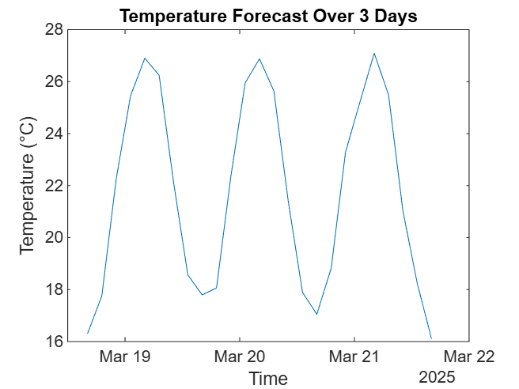
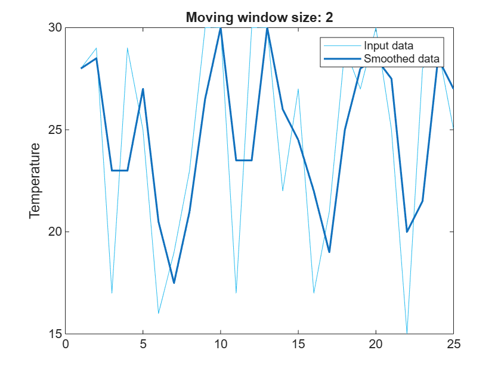

<a id="TMP_4fab"></a>

# Miami AI demo [](https://matlab.mathworks.com/open/github/v1?repo=yanndebray/miami)
<!-- Begin Toc -->

## Table of Contents
&emsp;[Data Prep](#TMP_31ef)
 
&emsp;[Live task](#TMP_8e3b)
 
<!-- End Toc -->
<a id="TMP_31ef"></a>

# Data Prep
```matlab
% Define the time range
startTime = datetime('now'); % Current time
endTime = startTime + days(3); % 3 days later
timeVector = startTime:hours(3):endTime; % Sampling every 3 hours

% Generate random temperature data (for example purposes)
temperatureData = randi([15, 30], length(timeVector), 1); % Random temperatures between 15 and 30 degrees

% Create the table
temperatureForecast = table(timeVector', temperatureData, ...
    'VariableNames', {'Time', 'Temperature'});

% Display the table
temperatureForecast
```


| |Time|Temperature|
|:--:|:--:|:--:|
|1|04-Mar-2025 10:41:34|28|
|2|04-Mar-2025 13:41:34|29|
|3|04-Mar-2025 16:41:34|17|
|4|04-Mar-2025 19:41:34|29|
|5|04-Mar-2025 22:41:34|25|
|6|05-Mar-2025 01:41:34|16|
|7|05-Mar-2025 04:41:34|19|
|8|05-Mar-2025 07:41:34|23|
|9|05-Mar-2025 10:41:34|30|
|10|05-Mar-2025 13:41:34|30|
|11|05-Mar-2025 16:41:34|17|
|12|05-Mar-2025 19:41:34|30|
|13|05-Mar-2025 22:41:34|30|
|14|06-Mar-2025 01:41:34|22|


```matlab
plot(temperatureForecast.Time,temperatureForecast.Temperature)
% Add labels and title to the plot
xlabel('Time');
ylabel('Temperature (°C)');
title('Temperature Forecast Over 3 Days');
```


<a id="TMP_8e3b"></a>

# Live task
```matlab
% Smooth input data
[newTable,winSize] = smoothdata(temperatureForecast, ...
    "movmean",SmoothingFactor=0.25,DataVariables="Temperature");

% Display results
figure
plot(temperatureForecast.Temperature,SeriesIndex=6,DisplayName="Input data")
hold on
plot(newTable.Temperature,SeriesIndex=1,LineWidth=1.5, ...
    DisplayName="Smoothed data")
hold off
title("Moving window size: " + string(winSize));
legend
ylabel("Temperature")
```



```matlab
clear winSize

```
