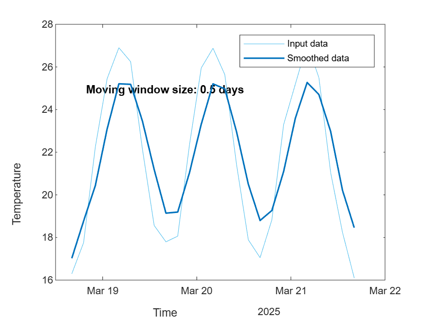

# Miami AI demo
<a name="beginToc"></a>

## Table of Contents
&emsp;[Data Prep](#data-prep)
 
&emsp;&emsp;[Dataset creation](#dataset-creation)
 
&emsp;&emsp;[Retime](#retime)
 
&emsp;&emsp;[Smooth](#smooth)
 
&emsp;[Classification](#classification)
 
&emsp;&emsp;[Training](#training)
 
&emsp;&emsp;[Inference](#inference)
 
<a name="endToc"></a>

# Data Prep
## Dataset creation
```matlab
% Define the time range
startTime = datetime('now'); % Current time
endTime = startTime + days(3); % 3 days later
timeVector = startTime:hours(3):endTime; % Sampling every 3 hours

% Convert time to hours elapsed since startTime
timeHours = hours(timeVector - startTime);

% Parameters for the temperature model
avgTemp = 22;       % Average temperature (degrees Celsius)
amp = 5;            % Amplitude of temperature variation
dailyPeriod = 24;   % Period of one full day (in hours)
phaseShift = -pi/2; % Phase shift to set the peak temperature around midday

% Generate temperature data following a logical day/night pattern
temperatureData = avgTemp + amp * sin(2*pi*timeHours/dailyPeriod + phaseShift) + randn(size(timeHours))*0.5;

% Create the table with both variables as column vectors
temperatureForecast = table(timeVector', temperatureData', ...
    'VariableNames', {'Time', 'Temperature'});

% Convert to Timetable
TT = table2timetable(temperatureForecast)
```
| |Time|Temperature|
|:--:|:--:|:--:|
|1|18-Mar-2025 16:30:01|17.2671|
|2|18-Mar-2025 19:30:01|18.6216|
|3|18-Mar-2025 22:30:01|22.2786|
|4|19-Mar-2025 01:30:01|25.8818|
|5|19-Mar-2025 04:30:01|27.5223|
|6|19-Mar-2025 07:30:01|24.6672|
|7|19-Mar-2025 10:30:01|22.0723|
|8|19-Mar-2025 13:30:01|18.6486|
|9|19-Mar-2025 16:30:01|16.1493|
|10|19-Mar-2025 19:30:01|18.5111|
|11|19-Mar-2025 22:30:01|22.5337|
|12|20-Mar-2025 01:30:01|24.7751|
|13|20-Mar-2025 04:30:01|27.0211|
|14|20-Mar-2025 07:30:01|25.2475|

```matlab
clf
plot(temperatureForecast.Time,temperatureForecast.Temperature)
% Add labels and title to the plot
xlabel('Time');
ylabel('Temperature (°C)');
title('Temperature Forecast Over 3 Days');
```


## Retime
```matlab
% Retime timetable
newTimetable = retime(TT,"regular","linear","TimeStep",hours(1))
```
| |Time|Temperature|
|:--:|:--:|:--:|
|1|18-Mar-2025 16:00:00|16.2313|
|2|18-Mar-2025 17:00:00|16.7161|
|3|18-Mar-2025 18:00:00|17.2009|
|4|18-Mar-2025 19:00:00|17.6857|
|5|18-Mar-2025 20:00:00|19.0415|
|6|18-Mar-2025 21:00:00|20.5385|
|7|18-Mar-2025 22:00:00|22.0354|
|8|18-Mar-2025 23:00:00|23.1629|
|9|19-Mar-2025 00:00:00|24.2304|
|10|19-Mar-2025 01:00:00|25.2980|
|11|19-Mar-2025 02:00:00|25.8643|
|12|19-Mar-2025 03:00:00|26.3493|
|13|19-Mar-2025 04:00:00|26.8344|
|14|19-Mar-2025 05:00:00|26.7136|

## Smooth
```matlab
% Smooth input data
[newTable,winSize] = smoothdata(TT,"movmean",days(0.5));

% Display results
figure
plot(TT.Time,TT.Temperature,"SeriesIndex",6,"DisplayName","Input data")
hold on
plot(TT.Time,newTable.Temperature,"SeriesIndex",1,"LineWidth",1.5, ...
    "DisplayName","Smoothed data")
hold off
title("Moving window size: " + string(winSize));
legend
ylabel("Temperature")
xlabel("Time")
```



```matlab
clear winSize
```

Go further

```matlab
edit 1_Data_Analysis/analyze2013stormData.mlx
```

# Classification

create a weather dataset that can be used for classification

```matlab
% Define the number of samples
numSamples = 1000;

% Generate synthetic weather data
temperature = randi([0, 40], numSamples, 1); % Temperature in degrees Celsius
humidity = randi([0, 100], numSamples, 1); % Humidity in percentage
windSpeed = randi([0, 20], numSamples, 1); % Wind speed in km/h

% Generate labels based on conditions
labels = strings(numSamples, 1);
for i = 1:numSamples
    if temperature(i) > 30 && humidity(i) < 50
        labels(i) = 'Sunny';
    elseif humidity(i) > 70
        labels(i) = 'Rainy';
    else
        labels(i) = 'Cloudy';
    end
end

% Create a table for the dataset
weatherData = table(temperature, humidity, windSpeed, labels, ...
    'VariableNames', {'Temperature', 'Humidity', 'WindSpeed', 'Condition'});

% Display the first few rows of the dataset
head(weatherData)
```

Derive test data

```matlab
testData = removevars(weatherData, "Condition");
writetable(testData,"2_Machine_Learning/testData.csv")
```

## Training
```matlab
classificationLearner
```


## Inference
```matlab
load 2_Machine_Learning/trainedModel.mat
load 2_Machine_Learning/testData.mat
pred = trainedModel.predictFcn
```

```matlab
Ypred = pred(testData)
```

```matlabTextOutput
Ypred = 1000x1
     3
     2
     2
     2
     3
     3
     3
     3
     2
     2

```

```matlab
% confusionchart
```

Go further

```matlab
classificationLearner("2_Machine_Learning/ClassificationLearnerSession.mat")
```
